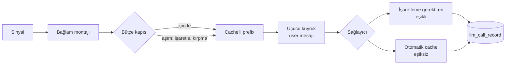

# Bağlam Mühendisliği ve Maliyet Muhasebesi

> Kapsam: bir extraction çağrısına **ne girer**, **hangi sırayla**, **ne kadara mal olur** ve
> bunun **nesi kaydedilir**. İki depo için ortak referanstır: motor (`humetric`) ve site
> (`../humetric-site`). Repo-içi belgedir, VitePress sitesine dahil değildir.
>
> Kaynak spec: `specs/001-context-engineering-cost/`.

## Baseline (FR-020)

Bu özelliğin **hiçbir kod değişikliği dağıtılmadan önce** yakalanan karşılaştırma noktası.
SC-002 (metrik değerleri değişmedi) ve SC-010 (maliyet farkı) yalnızca buna karşı kanıtlanabilir.

**Koşu tarihi:** 2026-09-09 · **Sağlayıcı:** DeepSeek (yerel kiracı 1'in yapılandırması;
Anthropic anahtarında kredi yok, Gemini free-tier kotası 20 sinyallik koşuya yetmiyor).

### (a) Metrik değerleri — canary replay

| | |
|---|---|
| Pack | `saha-hizmet-isci` |
| Canary | `packs/canary/saha-hizmet-isci-canary.yaml` (15 sinyal) |
| Sonuç | 13 geçti · 1 kaldı · 1 uyarı |
| Sürüklenme | 1 extraction · 2 curation |
| `prompt_hash` | `e6d166cccd78…` |
| `schema_hash` | `69036ac71fc5…` |

Ham koşu çıktısı yereldedir (`/tmp/replay_before.json`), depoya girmez. SC-002 bu koşuya karşı
kanıtlanır: A1 sonrası aynı komut aynı `prompt_hash` ile aynı değerleri vermelidir.

### (b) Maliyet — cost_bench

| | |
|---|---|
| Örneklem | 20 sinyal / 5 varlık, `--llm real --embed real` |
| **Ölçülen** | **1.604 token/sinyal** |
| 1.000 sinyale ölçeklenmiş | 1.603.800 token |
| Altyapı (bize maliyet) | €0,0127 / 1.000 sinyal |

SC-010 bu sayıya karşı raporlanır.

### Ölçüm notu — token tahmin katsayısı

`cost_bench` Türkçe metin için sağlayıcının raporladığı kullanıma karşı **1,9 karakter/token**
ölçmüş. Buna karşılık İngilizce extractor sistem promptu 2.985 karakterde 734 token, yani
**4,07 karakter/token**. Tek bir bölen ikisi için birden doğru olamaz; `config.py` bilinçli
olarak 1,9'u alır — büyük bir extraction bağlamında sinyal metni (Türkçe yarı) baskındır ve
fazla tahmin etmek bütçe kapısını geç değil erken tetikler.

## 1. Bağlam bütçesi

<!-- A2 doldurur: ne girer, hangi sırayla, üst sınır, aşımda ne olur (sessiz kırpma DEĞİL) -->

## 2. Prompt kompozisyonu

<!-- A3 doldurur: değişmez taban blok + pack'in alan çerçevesi; ezme neden hataydı -->

## 3. Cache katmanları

<!-- B1 doldurur: neyin stabil neyin uçucu olduğu, eşik, sağlayıcı farkları -->

## 4. Maliyet muhasebesi

### Nereye yazılır

`llm_call_record` **çağrı başına** bir satır taşır (güncellenmez — retry ve re-ask ayrı
satırlardır, çünkü gerçekten ayrı ödenmişlerdir). Migration `023` toplamı dörde ayırdı:

| Kolon | Anlam |
|---|---|
| `token_count` | **Değişmedi.** Girdi + çıktı toplamı; mevcut okuyucuları (`store.py:495`) aynen çalışır. |
| `input_tokens` | Sağlayıcının raporladığı girdi. |
| `output_tokens` | Sağlayıcının raporladığı çıktı. |
| `cache_read_tokens` | Cache'ten okunan girdi. |
| `cache_write_tokens` | Cache'e yazılan girdi. |

Tek yazma noktası `services/usage_service.py:record_llm_tokens()`; üç sağlayıcı dalı da
(Anthropic `agents/base.py`, OpenAI/DeepSeek ve Google `agents/multi_llm.py`) oraya geçirir.

### `0` ile `NULL` ayrımı

Kural "sıfır yazma" değil, **"uydurma"**. Test şudur: **alan yanıtta var mı** — değeri kaç
değil.

- Alan varsa değeri olduğu gibi yazılır, `0` olsa bile. Google
  `cached_content_token_count`'u her yanıtta döndürür ve isabet yokken `0` verir; bu gerçek bir
  ölçümdür.
- Alan hiç dönmüyorsa `NULL`. DeepSeek cache *yazma* sayısını raporlamaz → `cache_write_tokens`
  o yolda her zaman `NULL`.

`0` yazmak bu iki durumu tek durum hâline getirirdi — tam da bu özelliğin kaldırdığı körlük.

### Sağlayıcı başına alan eşlemesi

| Sağlayıcı | girdi / çıktı | cache okuma | cache yazma |
|---|---|---|---|
| Anthropic | `usage.input_tokens` / `.output_tokens` | `.cache_read_input_tokens` | `.cache_creation_input_tokens` |
| DeepSeek | `usage.prompt_tokens` / `.completion_tokens` | `.prompt_cache_hit_tokens` | raporlanmıyor → `NULL` |
| OpenAI | `usage.prompt_tokens` / `.completion_tokens` | `.prompt_tokens_details.cached_tokens` (doğrulanmadı) | raporlanmıyor → `NULL` |
| Google | `usage_metadata.prompt_token_count` / `.candidates_token_count` | `.cached_content_token_count` (isabet yokken `0`) | raporlanmıyor → `NULL` |

> DeepSeek'te `prompt_tokens` cache'lenen kısmı **içerir**; isabet sayısı ondan çıkarılmaz.

### Çağrı öncesi ölçüm

`context.py` sistem ve user bloklarını çağrıdan önce, yerel ve deterministik olarak ölçer;
sonuç `call_meta` üzerinden akar ve her metriğin `trace_data.measured_input_tokens` alanına
yazılır — bütçe aşılsın aşılmasın. Sağlayıcının sayım ucuna **runtime'da ağ çağrısı yapılmaz**.

Sapma çevrimdışı ölçülür: `scripts/calibrate_token_estimate.py`
`trace_data.measured_input_tokens` ile `llm_call_record.input_tokens`'ı eşleştirir. **İlk koşu:
%1,6 sapma** (böleni 1,90 → önerilen 1,93). Araç hiçbir dosyayı değiştirmez.

### A1 sonrası ilk ölçüm (2026-09-09, DeepSeek)

```
provider | token_count | input | output | cache_read | cache_write
deepseek |        1652 |  1147 |    505 |        640 |      (NULL)
deepseek |        1582 |  1142 |    440 |        640 |      (NULL)
```

Girdinin **~%57'si zaten cache'ten geliyordu** ve bu bugüne kadar hiçbir yerde görünmüyordu —
`token_count` tek sayıydı. SC-001 karşılandı.

**Davranış değişikliği yok (SC-002):** aynı canary, aynı `prompt_hash`, `Total diffs: 0`.

## Akış


