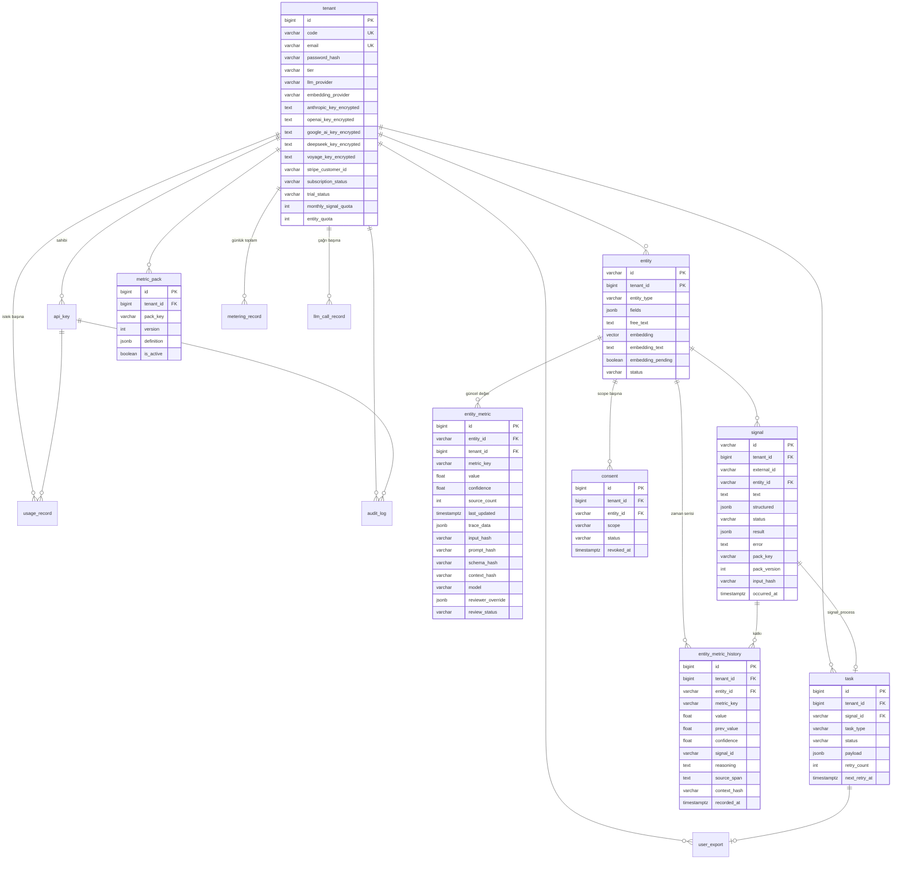
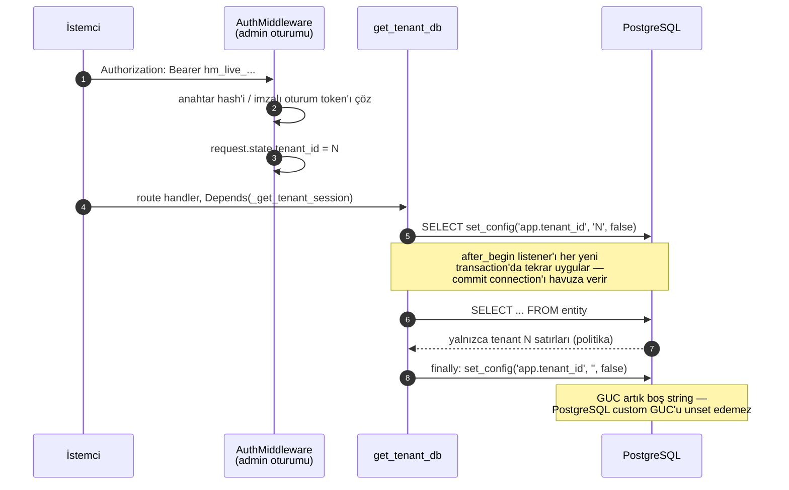
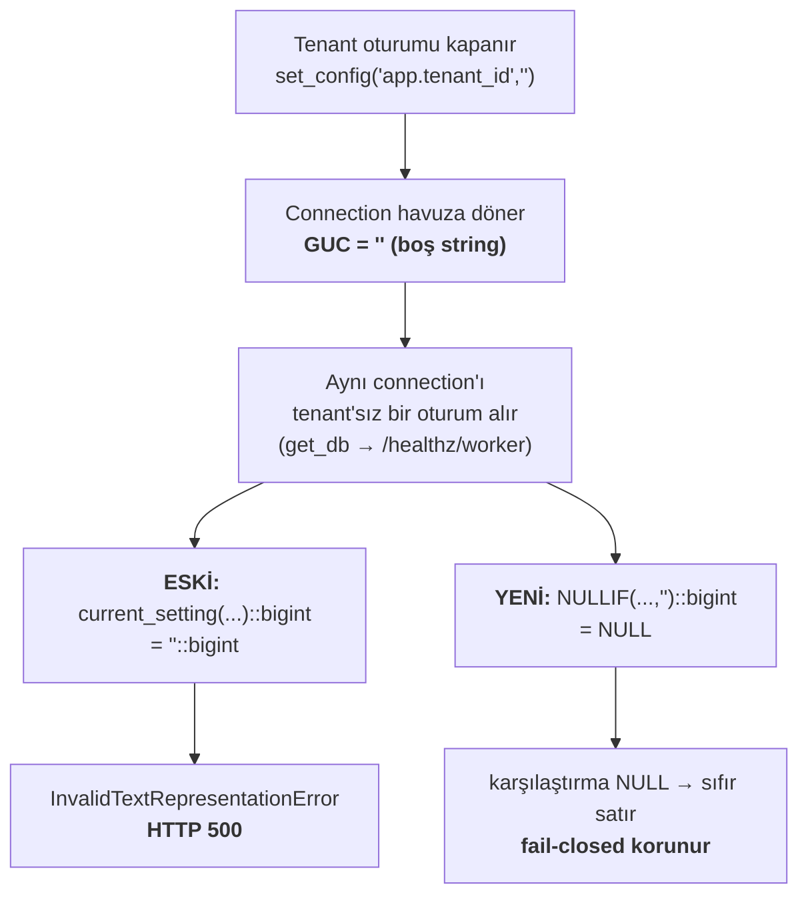
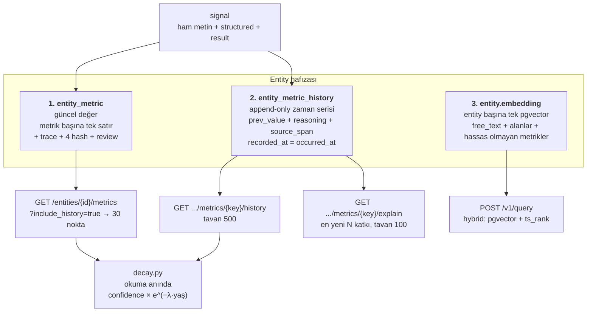
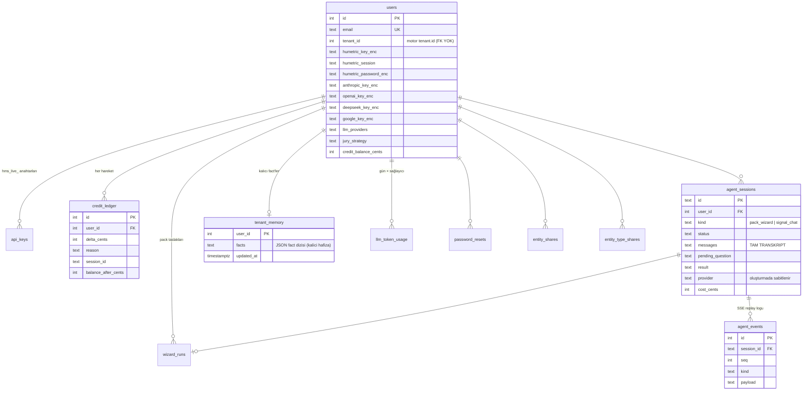

# Veri Modeli, RLS ve Hafıza

> Repo içi mimari referansı — yayınlanan siteye dahil değildir. Bkz.
> [`overview.md`](overview.md).

Motor veritabanı: **PostgreSQL 16 + pgvector**, `alembic_version = 022`,
14 uygulama tablosu. `src/humetric/db/models.py` tek kaynaktır.

## 1. Motor ER diyagramı



### Kısıt notları

| Tablo | Not |
|---|---|
| `entity` | **Bileşik PK `(id, tenant_id)`** — migration 009. Tenant'lar arası id çakışmasını engeller; `entity_metric`, `entity_metric_history`, `signal`, `consent` bileşik FK ile bağlanır. |
| `entity_metric` | `UNIQUE (tenant_id, entity_id, metric_key)` — entity başına metrik başına **tek** satır. CHECK: `value ∈ [-1,1]`, `confidence ∈ [0,1]`, `source_count ≥ 1`. |
| `entity_metric_history` | Append-only. `recorded_at` = sinyalin `occurred_at`'i (yokla `now()`), yazma zamanı değil — geçmiş kaynak zamanına göre sıralanır. |
| `signal` | `UNIQUE uq_signal_idempotency (tenant_id, external_id, entity_id)` → 409'un kaynağı. |
| `task` | CHECK `status ∈ {queued, processing, completed, failed}`, `task_type ∈ {signal_process, re_embed, lakehouse_export, export_request}`. |
| `metric_pack` | `UNIQUE (tenant_id, pack_key)`; versiyon yerinde artar, eski `definition` saklanmaz. |
| `review_status` | **CHECK kısıtı yok.** Kodda görülen değerler: `pending_review`, `reviewed`, `NULL`. |
| `metering_record` | `UNIQUE (tenant_id, date)` — günlük tenant toplamı; `/v1/tenant/dashboard`'ı besler. |
| `llm_call_record` | Çağrı başına granülerlik (pack/sinyal/sağlayıcı/model/token) — migration 020. `metering_record`'ın yerini almadı, yanına eklendi. |
| `usage_record` | `client`/`tool_name`/`call_id`/`duration_ms` migration 018'de eklendi; `COUNT(DISTINCT call_id)` = tool çağrısı, `COUNT(*)` = HTTP isteği. |

`models.py` docstring'i tablo sayısını yanlış veriyorsa güncelleyin — bu dosya
canlı şemadan doğrulanmıştır.

## 2. RLS

Tenant izolasyonu PostgreSQL seviyesinde zorlanır. `tenant` ve `alembic_version`
**hariç 13 tablonun** hepsinde `tenant_isolation` politikası vardır.



Politika ifadesi (migration 022 sonrası, 13 tabloda aynı):

```sql
tenant_id = NULLIF(current_setting('app.tenant_id', true), '')::bigint
```

### Migration 022 neyi düzeltti



Bu canlı bir hataydı: `GET /healthz/worker`, daha önce bir tenant oturumunun
kullandığı connection'ı alan **her** istekte 500 dönüyordu. Kök neden
`get_tenant_db`'nin teardown'ı değil — PostgreSQL'in custom GUC'u unset
edememesi; `set_config(..., NULL, ...)` de `''` saklar (`database.py:131-135`).

`NULLIF` fail-closed davranışı bozmaz: bağlam yoksa sıfır satır döner, hata değil.
Migration'ın `downgrade()`'i güvensiz biçimi geri getirir — yani rollback gerçekten
geri alır (ve hatayı geri getirir, doğru olan bu).

**Yeni tenant-scoped tablo eklerken:** politika + grant aynı migration'da olmalı
(`HM-DATA-02`). Grant bloğunu `020_llm_call_record.py`'den, **karşılaştırma
ifadesini `022`'den** kopyalayın — 020'nin kendi politikası diskte hâlâ çıplak
`current_setting(...)::bigint` biçiminde durur.

### Üç oturum tipi

| Oturum | Fabrika | Kim kullanır | RLS |
|---|---|---|---|
| Tenant | `get_tenant_db` / `_get_tenant_session` | 37/44 route | Uygulanır |
| Düz | `get_db` | Yalnızca `/healthz/db`, `/healthz/worker` | GUC yok → sıfır satır |
| Admin | `get_admin_async_session_factory` | worker, batch_worker, AuthMiddleware, UsageMiddleware | **Bypass** |

Lokalde `humetric` rolü SUPERUSER olduğu için RLS bypass edilir; uygulamanın
gerçekte ne gördüğünü test etmek için `humetric_app` rolüyle bağlanın
(bkz. `LOCAL_DB.md`).

## 3. Hafıza katmanları

**Motorda "kullanıcı hafızası" veya konuşma hafızası yoktur.** Ne sohbet, ne oturum,
ne mesaj tablosu var; dashboard oturumu `itsdangerous` ile imzalı **stateless**
token'dır (24 sa, sunucu tarafında satır yok). Motor tarafında **bir kullanıcı = bir
tenant**; en ince aktör granülerliği `usage_record.api_key_id` /
`audit_log.api_key_id`'dir.

Kalıcı olan şey **entity hafızasıdır**, üç katman:



### Katman detayları

**1. `entity_metric` — güncel durum.** Her sinyalde `upsert_metric` ile üzerine
yazılır. Sıra dışı yazma koruması: gelen `last_updated` eskiyse tüm payload atlanır,
yalnızca `source_count` max-merge edilir.

**2. `entity_metric_history` — zaman serisi.** `append_metric_history` commit
etmez, `upsert_metric`'in transaction'ına biner; ikisi ya birlikte yazılır ya hiç.
Reviewer override buraya satır **eklemez**.

**3. `entity.embedding` — semantik hafıza.** Entity başına **tek** vektör.
Metin `_build_embed_text_safe` (`store.py:1604-1624`) ile kurulur ve
`kvkk.sensitive_metrics` içindeki anahtarları **dışlar** — hassas veri vektöre
sızmaz. Boyut sağlayıcıya bağlı (`voyage`/`cohere` 1024, `openai` 1536) ve
pgvector kolonuna gömülüdür: `EMBED_DIM` değişimi şema migration'ı gerektirir.
Embedding başarısız olursa `embedding_pending = true` + `re_embed` task'ı.

### Decay — yazmaz, okurken uygulanır

`decay.py:17-45`: `effective_confidence = stored_confidence · e^(−λ · yaş_gün)`,
λ varsayılanı `ln2/365` (≈1 yıl yarı ömür), `DECAY_ENABLED` ile kapatılabilir.
Saklanan `confidence` hiç değişmez; katsayı `store._metric_row_to_read` ve her
geçmiş noktasında okuma anında uygulanır. Yazma anında çarpmak bilinçli olarak
reddedildi (`decay.py:3-7`) — aksi hâlde aynı veriyi iki kez okumak farklı sonuç
verirdi ve geçmiş yeniden hesaplanamaz olurdu.

### Retrieval

`rag.py` artık 28 satırlık deprecated bir shim; iş `Store.hybrid_search_entities`
(`store.py:943-1007`) içinde: pgvector `cosine_distance` sıralaması + `ts_rank`
(`to_tsvector('simple', free_text)`) + `fields[key]` JSONB eşitlik filtresi +
`entity_type` filtresi, `status='active'`. `POST /v1/query` bunu çağırır, istenirse
ardından LLM re-rank (`agents/ranker.py`, `__ranker__` sentinel pack'ine faturalanır).

## 4. Tenant başına ne kalıcı

| Granülerlik | Kalıcı veri |
|---|---|
| Tenant | `tenant` satırı (tier, trial, Stripe, **şifreli BYOK anahtarları**, sağlayıcı seçimi), `api_key` + scope'lar, `metric_pack`, `metering_record` (günlük), `llm_call_record` (çağrı), `usage_record` (istek), `audit_log`, `task`, `user_export` |
| Entity `(tenant_id, entity_id)` | `entity`, `entity_metric`, `entity_metric_history`, `signal`, `consent` |
| Kullanıcı | **Ayrı bir şey yok** — `tenant.email` / `email_verified` / `password_hash` dışında. Oturum satırı yok. |

## 5. Site veritabanı (ayrı repo, ayrı Postgres)

`humetric-site` **kendi PostgreSQL'ini** kullanır (`backend/src/db.ts`,
`DATABASE_URL`). Konuşma hafızası burada yaşar.

> **Migration framework yok.** Şema iki yerde elle senkron tutulur:
> `backend/schema.sql` (idempotent tam tanım, `psql -f` ile uygulanır) ve
> `runStartupTasks()` (`db.ts:35-198`, her boot'ta `ADD COLUMN IF NOT EXISTS`).
> Kolonu yalnızca birine eklemek dokümante edilmiş 1 numaralı hata kaynağıdır.



### Kullanıcı hafızası gerçekte nerede

| Hafıza türü | Yer |
|---|---|
| Konuşma transkripti | `agent_sessions.messages` (tam JSON) |
| Olay/SSE replay | `agent_events` (session içi sıralı, `?after_seq=N` ile yeniden oynatılır) |
| **Uzun vadeli fact'ler** | `tenant_memory.facts` — ajanın `remember_context` aracıyla yazdığı JSON dizisi, `user_id` başına tek satır (upsert) |
| Pack taslakları | `wizard_runs` (YAML, transkript, kritik puanı, `published_pack_key`) |
| Kredi geçmişi | `credit_ledger` (delta + sebep + `balance_after_cents`) |
| Site oturumu | **Kalıcı değil** — JWT HS256, 24 sa, tarayıcının `localStorage`'ında |
| Token tüketimi | `llm_token_usage` (kullanıcı × gün × sağlayıcı) |

`users.tenant_id` motor `tenant.id`'sine işaret eder ama **FK yoktur**; iki taraf
ayrı veritabanlarındadır ve biri sıfırlanırsa yetim kayıt oluşur.

**Ölü kalıntılar:** `humetric-site/data/humetric.db*` (SQLite öncesi dönemden,
hiçbir kod yolu açmıyor) ve `users.image_quota_used` / `image_quota_reset_at`
(hiçbir kod okumuyor/yazmıyor).

## 6. Migration geçmişi

| # | Ne yaptı |
|---|---|
| 001–004 | tenant/entity/entity_metric/api_key/consent/audit_log + RLS; `signal`; `metric_pack`; `task` + idempotency unique |
| 005–008 | tenant BYO anahtarları; Stripe + `metering_record`; `tenant.updated_at`; `tenant` grant'ları |
| 009 | `entity` PK → `(id, tenant_id)` — tenant'lar arası id çakışması düzeltmesi |
| 010 | İzlenebilirlik kolonları (hash'ler, `model`, `trace_data`, `reviewer_override`, `review_status`) |
| 011–013 | Türkçe kolon adlarının İngilizceye çevrilmesi + arkada kalan CHECK düzeltmeleri |
| 014 | `openai` / `google_ai` / `deepseek` anahtar kolonları (multi-provider BYOK) |
| 015 | `metering_record`'a **eksik kalan** RLS politikası — 006'nın açığının retrofit'i |
| 016 | `trial_started_at` / `trial_ends_at` / `trial_status` |
| 017 | `signal.occurred_at` + **`entity_metric_history` tablosu** |
| 018 | `usage_record`: `client`, `tool_name`, `call_id`, `duration_ms` |
| 019 | `user_export` tablosu + `task_type`'a `export_request` |
| 020 | `llm_call_record` tablosu (pack/sinyal başına token) |
| 021 | `context_hash` → `entity_metric` + `entity_metric_history` |
| **022** | Tüm `tenant_isolation` politikalarına `NULLIF(..., '')` — boş GUC 500'ü |
