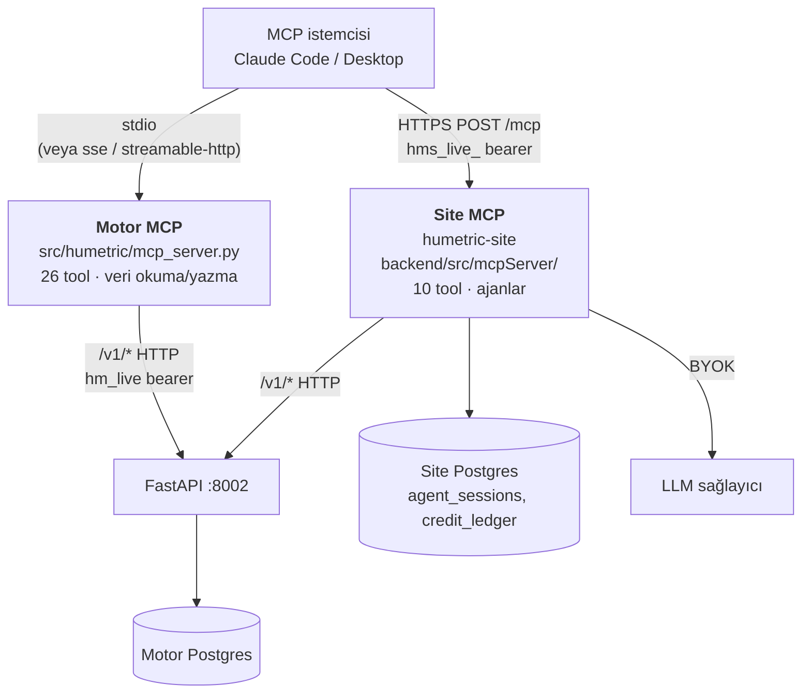
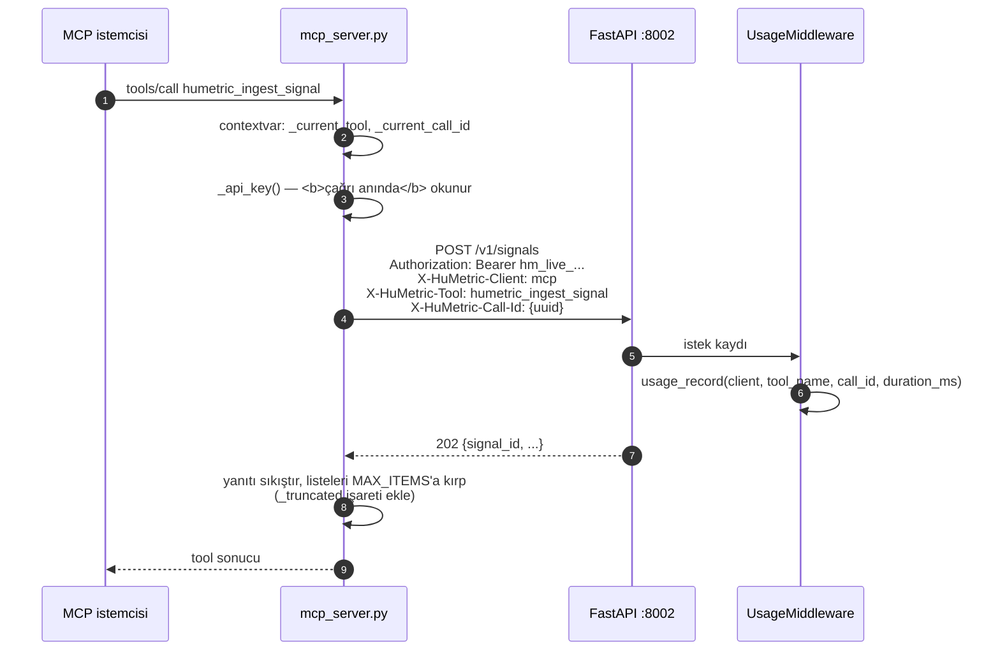
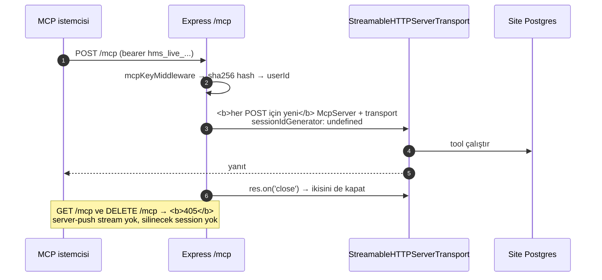
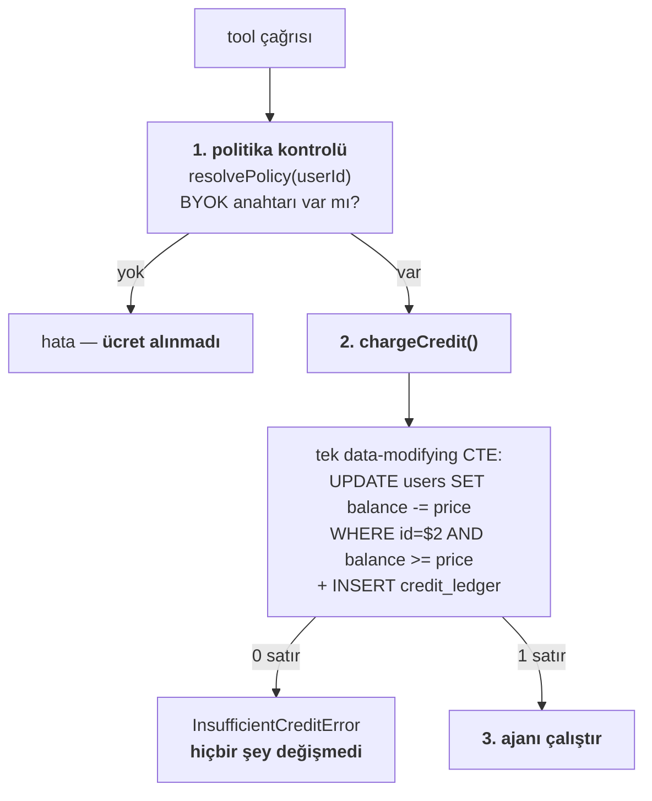
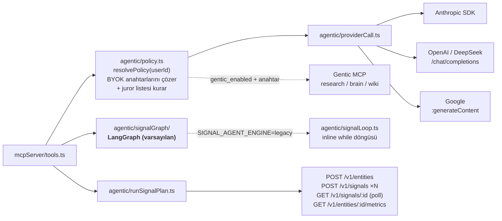

# MCP — İki Ayrı Sunucu

> Repo içi mimari referansı — yayınlanan siteye dahil değildir. Bkz.
> [`overview.md`](overview.md).

HuMetric ekosisteminde **iki farklı MCP sunucusu** var. Aynı ürünün parçaları ama
farklı repoda, farklı transport'ta, farklı auth'ta ve farklı ücretlendirmede.
Karıştırılmaları en sık yapılan hata.

| | Motor MCP | Site MCP |
|---|---|---|
| Repo / yol | `humetric` · `src/humetric/mcp_server.py` | `humetric-site` · `backend/src/mcpServer/` |
| Çalışma biçimi | Ayrı süreç, kullanıcının makinesinde | Express sürecinin içinde, `/mcp` altında mount |
| Transport | `FastMCP`, varsayılan **stdio**; `--transport sse\|streamable-http` | **Streamable HTTP, stateless** |
| Auth | `HUMETRIC_MCP_API_KEY` → `Authorization: Bearer hm_live_...` | `Authorization: Bearer hms_live_...` |
| DB erişimi | **Yok** | Site Postgres'ine doğrudan |
| Amaç | Veriyi okumak/yazmak (CRUD + trace + consent) | Ajan çalıştırmak (pack üretmek, sinyal planlamak) |
| Tool sayısı | 26 + 2 resource + 3 prompt | 10 |
| Ücret | Yok (API key kotası) | Flat-fee kredi + BYOK |

## 1. Motor MCP

### Tasarım kararı: sıfır bağımlılık

`mcp_server.py` `humetric` paketinden **hiçbir şey import etmez** ve veritabanı
bağlantısı tutmaz (`mcp_server.py:68-70`). REST API'nin saf HTTP istemcisidir.
Sonuçları:

- MCP sunucusu API'nin gördüğünden fazlasını göremez — RLS ve scope kontrolü tek
  yerde kalır.
- Kullanıcının makinesinde çalışır, prod DB kimlik bilgisi gerektirmez.
- API contract'ı değişmedikçe motor sürümünden bağımsızdır.

**Ayrıntılar:**

- **Anahtar çağrı anında okunur** (`_api_key()`, `mcp_server.py:82-91`), import
  anında değil. Eksik anahtar "sunucu başlatılamadı" yerine okunabilir bir ilk-çağrı
  hatası verir.
- **Loglar stderr'e** gider — stdout protokol kanalıdır (`mcp_server.py:59-65`).
- **Transport dayanıklılığı:** paylaşılan `httpx.AsyncClient`; `TransportError`'da
  client sıfırlanıp bir kez yeniden denenir (`_send_with_retry`, 161-209).
- **Hata çevirisi:** HuMetric'in `{"error":{code,message}}` zarfı `_describe_error`
  ile okunabilir mesaja dönüşür; kod (`tier_limit_exceeded`, `consent_required`)
  korunur.
- **Annotation'lar:** her tool `READ_ONLY` / `WRITES` / `DESTRUCTIVE` olarak
  işaretlidir, istemci onay isteyebilsin diye.
- **Kullanım telemetrisi:** `X-HuMetric-Client/Tool/Call-Id` başlıkları
  `usage_record`'a düşer (migration 018) → `GET /v1/usage/calls`.
  `COUNT(DISTINCT call_id)` tool çağrısı, `COUNT(*)` HTTP isteği verir.

### Tool → endpoint eşlemesi

| Tool | Endpoint |
|---|---|
| `humetric_ingest_signal` | `POST /v1/signals` |
| `humetric_get_signal` | `GET /v1/signals/{id}` |
| `humetric_get_signal_trace` | `GET /v1/signals/{id}/trace` |
| `humetric_list_entity_signals` | `GET /v1/entities/{id}/signals` |
| `humetric_upsert_entity` | `POST /v1/entities` |
| `humetric_get_entity` | `GET /v1/entities/{id}` |
| `humetric_list_entities` | `GET /v1/entities` |
| `humetric_get_entity_metrics` | `GET /v1/entities/{id}/metrics` |
| `humetric_explain_metric` | `GET /v1/entities/{id}/metrics/{key}/explain` |
| `humetric_metric_history` | `GET /v1/entities/{id}/metrics/{key}/history` |
| `humetric_query_entities` | `POST /v1/query` |
| `humetric_list_packs` | `GET /v1/packs` |
| `humetric_get_pack` | `GET /v1/packs/{key}` |
| `humetric_create_pack` | `POST /v1/packs` |
| `humetric_update_pack` | `PUT /v1/packs/{key}` |
| `humetric_list_pending_review` | `GET /v1/metrics/pending-review` |
| `humetric_review_metric` | `PUT /v1/metrics/{entity}/{key}/review` |
| `humetric_get_consent` | `GET /v1/consent/{entity_id}` |
| `humetric_grant_consent` | `POST /v1/consent` |
| `humetric_revoke_consent` | `DELETE /v1/consent/{entity_id}` |
| `humetric_dashboard` | `GET /v1/tenant/dashboard` |
| `humetric_usage_report` | `GET /v1/usage` |
| `humetric_pack_usage` | `GET /v1/usage/packs` |
| `humetric_call_history` | `GET /v1/usage/calls` |
| `humetric_audit_logs` | `GET /v1/audit-logs` |
| `humetric_health` | 3× `GET /healthz*`, tek `call_id` altında |

**Resource'lar:** `packs_resource` (`GET /v1/packs`),
`dashboard_resource` (`GET /v1/tenant/dashboard`).
**Prompt'lar:** `analyze_entity_prompt`, `investigate_signal_prompt`,
`draft_metric_pack_prompt`.

### Bilinçli olarak açılmayanlar

41 endpointten 25'i açık. Kapalı olanlar (`mcp_server.py:17-37`):
`register`, `login`, `verify-email`, api-key oluştur/sil, `rotate-api-key`,
`tenant/keys`, `billing/checkout`, `billing/webhook`, `admin/usage`,
`packs/wizard`.

Gerekçe: bunlar ya kimlik/ödeme sınırında ya da bir ajanın kendi başına yapmaması
gereken işler (kendine yeni anahtar üretmek gibi). Pack wizard'ı motorda kapalıdır
çünkü o iş **sitenin MCP'sine** taşındı.

### Consent kuralı

MCP sunucusunun kendi talimatlarında (`mcp_server.py:307-346`) açıkça yazılıdır:
hassas metrik üretecek bir sinyal göndermeden önce `humetric_get_consent` ile
durum kontrol edilir; **rıza yoksa ajan `humetric_grant_consent` çağırmaz** —
rıza veri sahibinin beyanıdır, ajanın varsayımı değil. Kullanıcıya bildirilir.

## 2. Site MCP

Amaç farklı: veri okumak değil, **ajan çalıştırmak**. İki ajan var — Pack Wizard
(doğal dilden MetricPack YAML'ı) ve Signal Chat (metinden sinyal planı).

### Stateless transport

Session affinity olmadığı için replikalar arasında yatay ölçeklenir. `GET`/`DELETE`
bilinçli olarak 405 döner.

**Anahtarlar:** `hms_live_` + 24 rastgele bayt hex. Yalnızca **sha256 hash'i** ve
12 karakterlik gösterim öneki saklanır; düz metin bir kez döner ve geri alınamaz.
Panel oturumunun ömründen bağımsızdır — bu bilinçli: MCP anahtarı 24 saatlik JWT'ye
bağlı olsaydı her gün kopardı.

### Tool'lar ve fiyatlar

| Tool | Ücret |
|---|---|
| `humetric_pack_wizard_start` | 50¢ |
| `humetric_pack_wizard_answer` | 15¢ |
| `humetric_pack_wizard_status` | ücretsiz |
| `humetric_pack_wizard_cancel` | ücretsiz |
| `humetric_signal_chat_start` | 25¢ |
| `humetric_signal_chat_answer` | 10¢ |
| `humetric_signal_chat_run_plan` | 20¢ |
| `humetric_signal_chat_status` | ücretsiz |
| `humetric_signal_chat_cancel` | ücretsiz |
| `humetric_mcp_credit_balance` | ücretsiz |

Kaynak: `backend/src/billing.ts:26-32`. Durum/iptal ücretsizdir — bir ajanın
kendi ilerlemesini yoklaması para götürmemeli.

### Ücretlendirme modeli: flat-fee + BYOK

İki maliyet ayrıdır ve karıştırılmamalıdır:

- **LLM/Gentic maliyeti** kiracının kendi BYOK anahtarından, **kendi faturasına**
  düşer. Platform bunu ölçmez, aracılık etmez.
- **Kredi** platform/orkestrasyon ücretidir: işlem tipi başına **sabit**, önceden
  bilinen bir rakam — gerçekleşen maliyetin yaklaşığı değil.

Bu ayrım, ücretlendirmenin neden bu kadar basit olabildiğini açıklar:

**Neden tek statement:** bakiye düşme ve defter kaydı ayrı iki sorgu olduğunda
araya giren bir hata bakiyeyi düşürüp defteri boş bırakıyordu — para kaybolur,
kullanıcı ne için ödediğini göremez (`billing.ts:52-56`). Tek statement Postgres'te
zaten implicit transaction'dır.

**Neden rezerve-sonra-uzlaştır yok:** ücret sabit ve önceden biliniyor; ölçülen bir
maliyet değil. Yetersiz bakiyede hiç satır dönmez, oturum hiç başlamaz.

**Neden refund yolu yok:** sıralama disiplini sayesinde gerek kalmıyor.
`*_answer` tool'larında politika **ücretten önce** yeniden kontrol edilir (rotasyona
uğramış bir anahtar bir tur para götürmesin diye); `run_plan` ise `applied_at`
idempotency'sini, `MCP_MAX_PLAN_SIGNALS = 8` sınırını **ve** motor token'ının
varlığını ücretten önce doğrular. Ücret alındığı noktada başarısız olabilecek bir
şey kalmamış olur.

### Ajan çalışma zinciri

LLM çağrısı **MCP katmanında değil**, `agentic/` altındadır. Sağlayıcı ve juror
listesi oturum **oluşturulurken sabitlenir** (`agent_sessions.provider`,
`jury_providers`, `jury_strategy`) — böylece tur ortasında tercih değişirse oturum
başka bir anahtara kaymaz.

Signal Chat başlarken `GET /v1/packs/:key` ile pack'i doğrular; `run_plan` ise
planı motora uygular. Aynı işin tarayıcı tarafındaki ikizi
`components/packtest/PlanRunner.tsx`'dir.

### Yazdığı/okuduğu tablolar

| Tablo | Erişim |
|---|---|
| `users` | okuma: BYOK `*_key_enc`, `llm_provider(s)`, `jury_strategy`, `gentic_*`, `credit_balance_cents`, motor kimlik bilgileri |
| `agent_sessions` | okuma/yazma: durum, transkript, bekleyen soru, sonuç |
| `agent_events` | yazma: SSE replay logu |
| `credit_ledger` | yazma: her ücret |
| `api_keys` | güncelleme: `last_used_at` (fire-and-forget) |
| `llm_token_usage`, `tenant_memory` | dolaylı — ajan döngüsü üzerinden |

## 3. Hangisini ne zaman

| İhtiyaç | Sunucu |
|---|---|
| Entity/sinyal/metrik okumak, sinyal göndermek | Motor MCP |
| Trace, explain, geçmiş, pending-review | Motor MCP |
| Consent sorgulamak | Motor MCP |
| Kullanım/fatura raporu | Motor MCP |
| Sıfırdan pack tasarlamak (doğal dilden YAML) | Site MCP (`pack_wizard`) |
| Serbest metinden sinyal planı çıkarmak | Site MCP (`signal_chat`) |
| Elinde hazır YAML varsa yayımlamak | Motor MCP (`humetric_create_pack`) |
