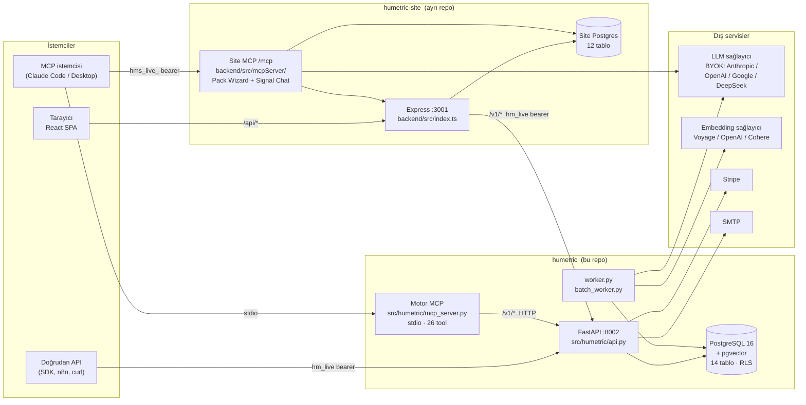
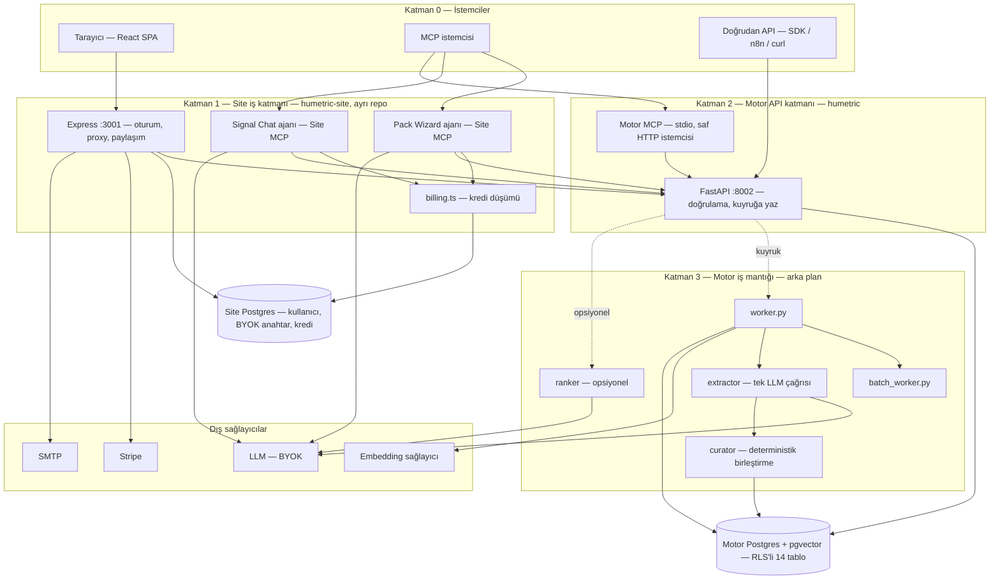
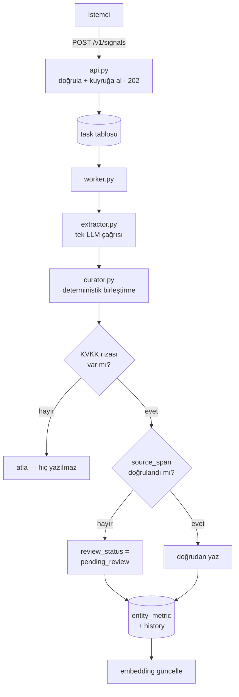
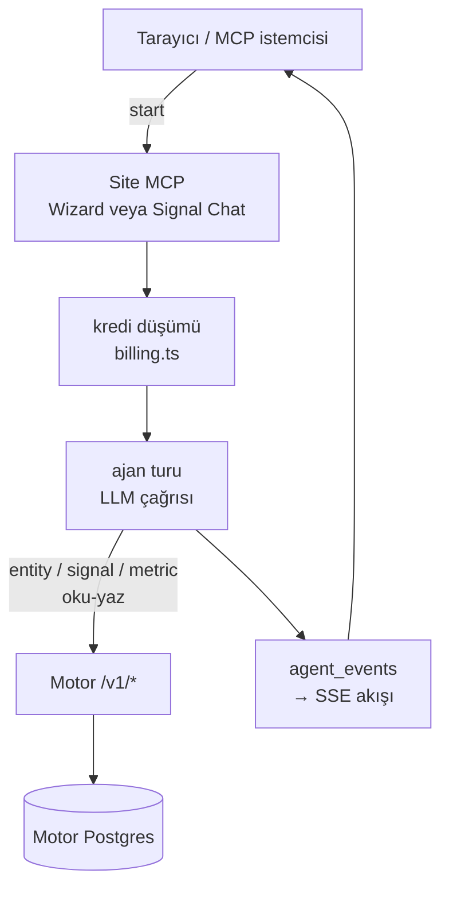
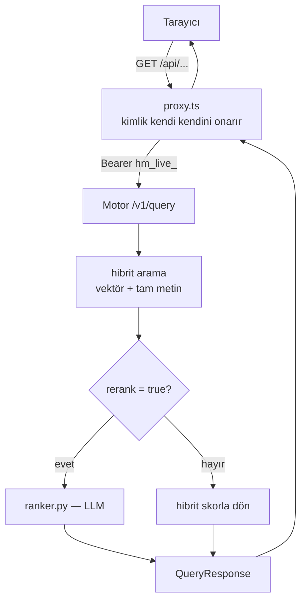
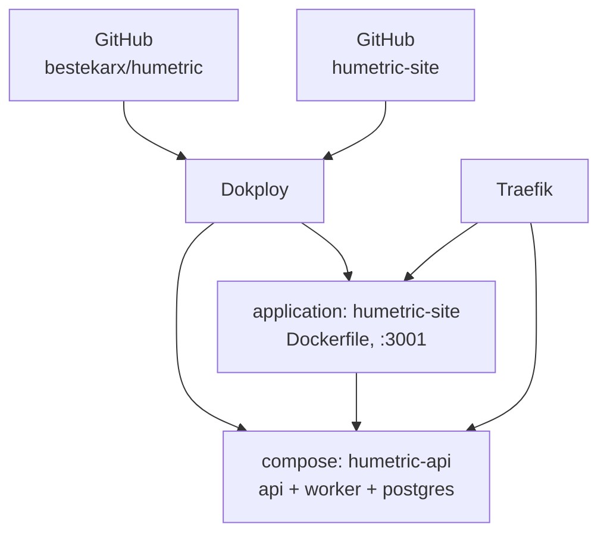

# Sistem Haritası

> Bu dosya **repo içi mimari referansıdır**, yayınlanan VitePress sitesinin parçası
> değildir (`.vitepress/config.ts` → `srcExclude`). Diyagramlar GitHub'ın native
> Mermaid render'ıyla görüntülenir. İddiaların yanındaki `dosya:satır` referansları
> yazıldığı andaki koda aittir — çelişki görürsen koda güven, dosyayı güncelle.

HuMetric iki ayrı repodan oluşur. Bu repo (`humetric`) **sadece backend motorudur**;
web sitesi ve dashboard ayrı bir projede (`../humetric-site`) yaşar ve motoru HTTP
üzerinden tüketir.

## Topoloji

**Kritik nokta:** motor MCP'si veritabanına *hiç* dokunmaz — REST API'nin saf HTTP
istemcisidir ve `humetric` paketinden hiçbir şey import etmez
(`mcp_server.py:68-70`). Site MCP'si ise site Postgres'ine doğrudan yazar.

## İş katmanları — büyük resim

> Aynı içeriğin bağımsız, kendi kendine yeten bir sayfası:
> [`business-blueprint.html`](business-blueprint.html) (Mermaid.js CDN'den yüklenir, tarayıcıda
> doğrudan açılabilir). Kanonik kaynak yine burasıdır — ikisi çelişirse buna güven.

Yukarıdaki topoloji hangi sürecin hangi porta bağlandığını gösterir; aşağıdaki diyagram aynı
sistemi **iş sorumluluğu** eksenine göre katmanlar (istemci → site iş katmanı → motor API →
motor iş mantığı → veri → dış sağlayıcı) hâlinde tekrar çizer.

### Üç ana iş akışı

Aynı sistemde üç işlem üç farklı yoldan geçer: sinyal işleme kuyruklu ve asenkron, ajan
oturumu çok turlu ve ücretli, sorgu senkron ve LLM'i opsiyonel.

`001-context-engineering-cost` planı bu resmin tam olarak **Katman 2 ↔ Katman 3** sınırındaki
tek bir hücreye — extraction çağrısının bağlamına ve cache'ine — odaklanır; geri kalan her şey
o planın kapsamında değişmeden kalır.

## Bileşen sorumlulukları

| Bileşen | Sorumluluk | Sınır |
|---|---|---|
| `api.py` (FastAPI :8002) | Tüm HTTP route'ları, senkron doğrulama, kuyruğa iş bırakma | LLM çağırmaz (tek istisna: `/v1/query` re-rank ve `/v1/packs/wizard`) |
| `worker.py` | Uzun ömürlü kuyruk tüketicisi, tüm task tipleri, zamanlayıcılar | Tek LLM çağrısı: extraction |
| `batch_worker.py` | Tek seferlik backfill; Anthropic Batches API (%50 maliyet) | Yalnızca `signal_process` |
| `store.py` | Tüm veri erişimi (SQLAlchemy 2.0 async) | Route handler'ı SQL yazmaz |
| `agents/` | LLM'e giden yapılandırılmış çağrılar | `curator` **LLM değil** — deterministik Python |
| `humetric-site` Express | Oturum, BYOK anahtar saklama, kredi, paylaşım linkleri, ajan oturumları | Motor verisini kendi DB'sine kopyalamaz |
| Site MCP | Pack Wizard + Signal Chat ajanları, kredi düşme | Motor DB'sine erişmez, `/v1/*` üzerinden gider |

## İki repo neden ayrı

`humetric` açık kaynak backend'dir; site/dashboard kapalı ve ayrı deploy edilir.
Pratik sonuçları:

- Site/frontend değişikliği bu repoya **girmez** (`CLAUDE.md` açılış bloğu).
- Kimlik iki tarafta ayrı yaşar: site `users` tablosu ↔ motor `tenant` tablosu
  `users.tenant_id` ile eşleşir ama **aralarında FK yoktur**; biri sıfırlanırsa
  yetim kayıt oluşur.
- Motor tarafında "kullanıcı" diye ayrı bir varlık yok: **bir kullanıcı = bir tenant**.
  Ayrıntı: [`data-model.md`](data-model.md#hafıza-katmanları).

## Portlar

| Servis | Port | Kaynak |
|---|---|---|
| Motor API | 8002 | `uvicorn humetric.api:app --port 8002` |
| Site Express | 3001 | `backend/src/config.ts` (`PORT \|\| 3001`) |
| Site Vite (dev) | 5173 | `frontend/vite.config.ts`, `/api` → `:3001` proxy |
| Postgres (Homebrew, Docker'sız) | **5433** | `LOCAL_RUN.md` |
| Postgres (Docker Compose) | **5434** | `docker-compose.yml` |

Prod'da site kendi build'ini servis eder, tek port olur.

## Deploy

Dokploy host adresi, proje ve servis ID'leri **gitignored** `CLAUDE.local.md`
dosyasındadır — bu repoya yazılmaz.

## Devamı

- Sinyal boru hattı, promptlar, pack'ler → [`pipeline.md`](pipeline.md)
- Tablolar, RLS, hafıza katmanları → [`data-model.md`](data-model.md)
- İki MCP sunucusu → [`mcp.md`](mcp.md)
- Site iç mimarisi → [`site.md`](site.md)
- Bağlam bütçesi, prompt kompozisyonu, cache ve maliyet muhasebesi →
  [`context-engineering.md`](context-engineering.md)
