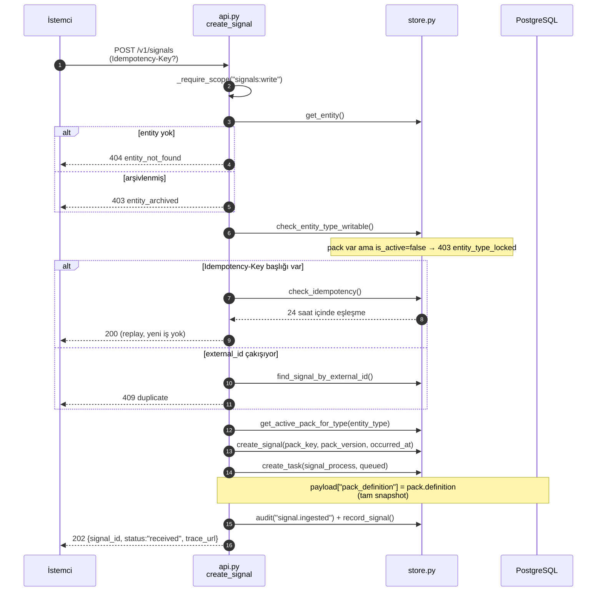
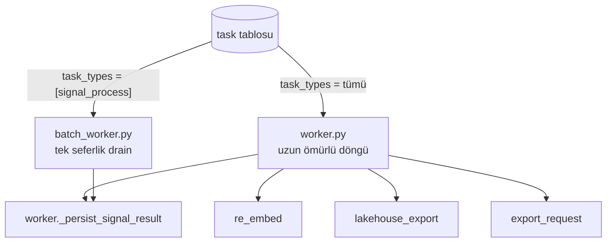
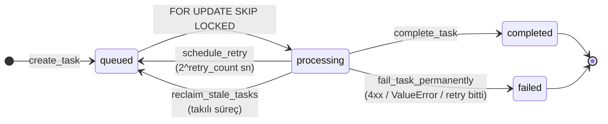
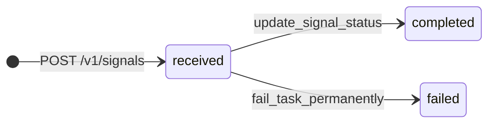
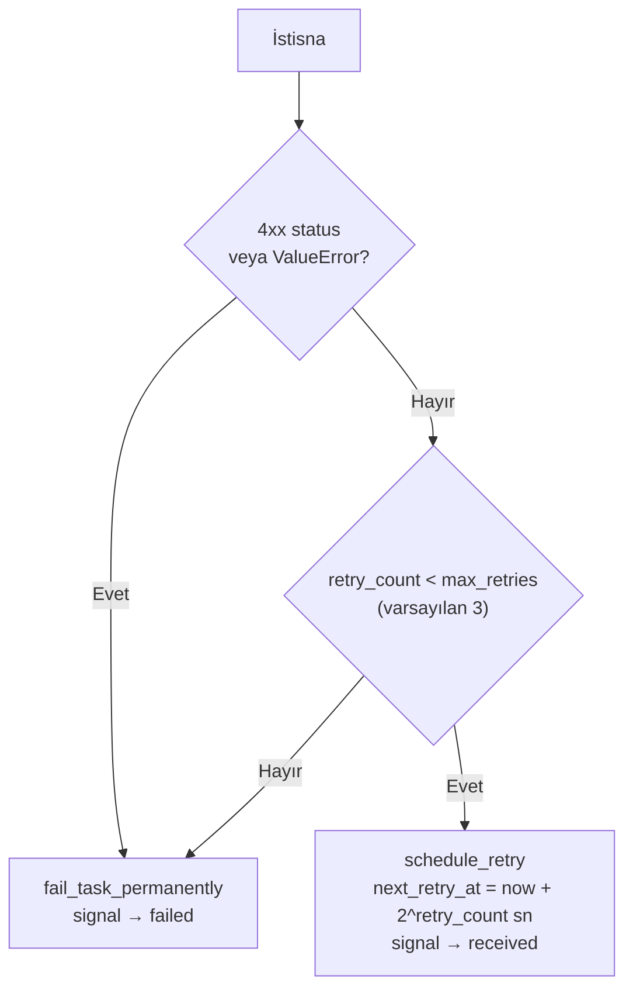
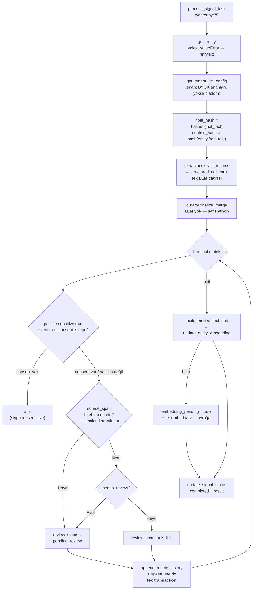
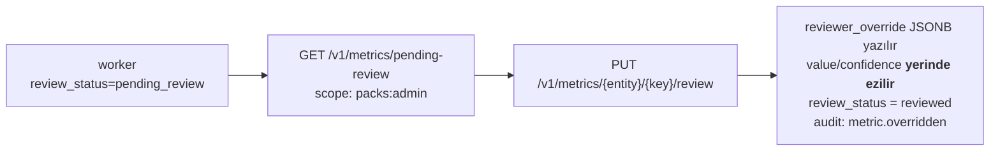
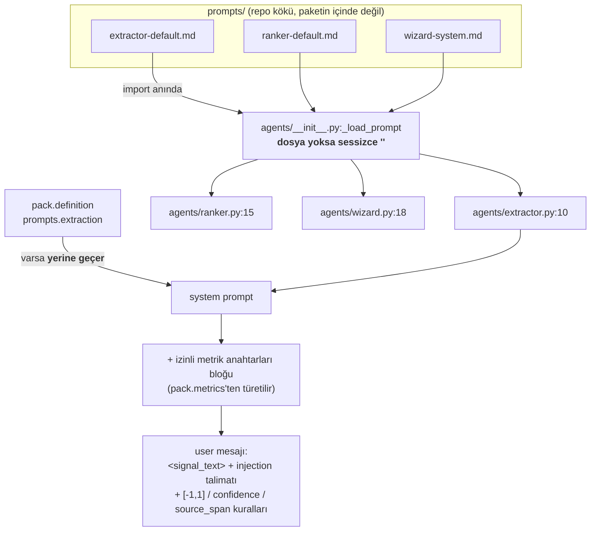
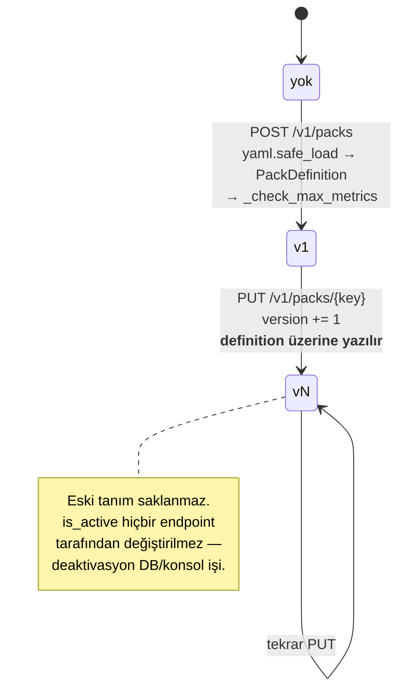
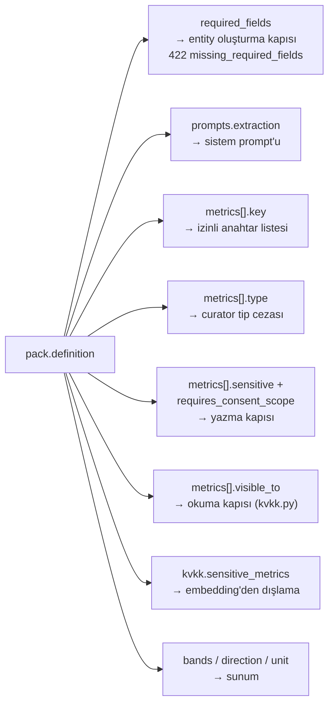

# Sinyal Boru Hattı, Promptlar ve Pack'ler

> Repo içi mimari referansı — yayınlanan siteye dahil değildir. Bkz.
> [`overview.md`](overview.md).

## 1. Ingest — senkron kısım

`POST /v1/signals` LLM çağırmaz. Doğrular, kuyruğa iş bırakır, **202** döner.



**Neden pack snapshot'ı:** pack tanımı `task.payload`'a kopyalanır (`api.py:882`).
İş kuyrukta beklerken pack düzenlenirse uçuştaki çıkarım değişmez — sonuç, o an
geçerli olan tanımla reprodüksiyona uygun kalır. `re_embed` task'ı bilinçli olarak
**canlı** pack'i okur (`worker.py:282-296`), çünkü embedding metni güncel hassaslık
kurallarını yansıtmalıdır.

Yarış durumu: iki eşzamanlı istek aynı `Idempotency-Key` ile gelirse
`uq_signal_idempotency` üzerinde `IntegrityError` yakalanır ve 409'a çevrilir
(`api.py:856-870`) — 500 değil.

## 2. Kuyruk — tek tablo, iki tüketici



| | `worker.py` | `batch_worker.py` |
|---|---|---|
| Yaşam | Sürekli, `WORKER_POLL_INTERVAL_S` aralıklı | `python -m humetric.batch_worker`, kuyruk boşalınca çıkar |
| Task tipleri | `signal_process`, `re_embed`, `lakehouse_export`, `export_request` | Sadece `signal_process` |
| LLM çağrısı | Sinyal başına senkron | Anthropic **Batches API** (%50 maliyet); OpenAI/Google/DeepSeek tenantları senkron |
| Ek mod | — | `--weekly`: kronolojik, entity başına tek iş |
| Zamanlayıcılar | Nightly export, trial expiry, export cleanup | Yok |

Her ikisi de **admin (RLS-bypass) oturumu** kullanır, çünkü `task` tablosunda RLS
FORCE'ludur ve kısıtlı rol GUC olmadan sıfır satır görür (`worker.py:593-597`).
Tenant bağlamı iş bazında `set_config('app.tenant_id', ...)` ile kurulur, `finally`
bloğunda `''`'a çekilir (`worker.py:492-495`) — bu boş GUC durumu migration 022'nin
düzelttiği tuzağın kaynağıdır, bkz. [`data-model.md`](data-model.md#rls).

### İş kapma

```sql
-- store.py:1019-1045
SELECT * FROM task
WHERE status = 'queued'
  AND (next_retry_at IS NULL OR next_retry_at <= now())
ORDER BY created_at ASC
LIMIT :batch_size
FOR UPDATE SKIP LOCKED;
```

Kapılan satırlar hemen `processing` + `started_at` alır. Süreç çökerse satır
`processing`'de kalır; `reclaim_stale_tasks` (`store.py:1112-1127`) belirli süreden
eski `processing` satırlarını `queued`'a geri alır.

`--weekly` modunda `get_next_chronological_batch` (`store.py:1047-1110`) raw SQL CTE
ile en eski zaman kovasını bulur ve `DISTINCT ON (tenant_id, entity_id)` ile entity
başına tek iş seçer — böylece aynı entity'nin sinyalleri sırayla işlenir.

### Durum makineleri





**Dikkat:** `signal.status` CHECK'i `processing`'e izin verir ama worker sinyali asla
`processing`'e çekmez — `received → completed | failed` gider. Retry sırasında sinyal
`received`'a geri alınır (`worker.py:428-442`).

### Hata sınıflandırması



LLM katmanında ayrıca SDK'nın kendi retry'ı var (`LLM_MAX_RETRIES`); `BadRequestError`
(400) retry'sız olarak yeniden fırlatılır (`agents/base.py:159-161`).

## 3. İşleme — extraction → deterministik merge → yazma



### Curator artık LLM değil

`agents/curator.py:finalize_merge` (54-87) tamamen deterministiktir:

- Yeni anahtar → doğrudan geçer.
- Var olan anahtar → güven ağırlıklı ortalama:
  `value = old·(1−w) + new·w`, &nbsp;`w = new_conf / (old_conf + new_conf)`.
- `_finalize_metric` (25-51): `CONFIDENCE_THRESHOLD` (0.55) altındakileri **atar**
  (`needs_review` değilse), değeri `[-1, 1]`'e kırpar, pack'teki tipe uymayan
  metriğe **−0.2 güven cezası** uygular.

Sonuç: sinyal başına **tek** LLM çağrısı, ve trace'te `curator_model` her zaman
`None`. Curator prompt dosyası **yok** ve olmamalıdır. Bu değişiklik `43845ad`'de
yapıldı; altı pack'ten curation prompt'ları `f36d3dd`'de kaldırıldı.

### İki yazma kapısı

**KVKK kapısı** (`worker.py:181-190`) — yazma anında çalışır. Pack'te
`sensitive: true` + `requires_consent_scope` olan metrik, o entity için geçerli
consent yoksa **hiç yazılmaz**. Okuma tarafında ayrıca `kvkk.py:53-111` filtresi var;
yani hassas veri hem yazılmaz hem de rıza iptal edilirse anında görünmez olur.

**`source_span` doğrulaması** (`worker.py:45-62`) — modelin alıntıladığı kanıt
parçası, boşluklar normalize edilerek sinyal metninde birebir aranır. İki şekilde
başarısız olur:
1. Alıntı metinde yok → model uydurmuş.
2. Alıntı metinde **var** ama kendisi bir talimat gibi okunuyor
   (`_INJECTION_QUARANTINE_PATTERN`: "ignore previous instructions", "incelemeye gerek
   yok", "set X to 1.0" vb.) → prompt injection şüphesi.

Her iki durumda metrik yazılır ama `review_status = "pending_review"` alır.
Span yoksa doğrulanmış sayılır — pack prompt'ları span istemek zorunda değil.

### İnsan incelemesi



**Bilinen davranış:** reviewer override `entity_metric_history`'ye satır **eklemez**
(`store.py:1349-1384`) — geçmiş zaman serisi sadece boru hattı yazımlarını içerir.

### Bilinen tuhaflıklar

- Embedding metni **yazma öncesi** snapshot'tan kurulur:
  `_build_embed_text_safe(entity, existing_metrics, pack_def)` (`worker.py:253`)
  `existing_metrics`'i alır, yeni yazılan değerleri değil. Yani vektör bir sinyal
  geriden gelir; bir sonraki sinyal veya `re_embed` yakalar.
- Sıra dışı yazma koruması: `upsert_metric` (`store.py:159-207`) gelen
  `last_updated` mevcut değerden eskiyse **tüm payload'ı atlar**, sadece
  `source_count`'u max-merge eder. `entity_metric` "en güncel değer" tablosudur;
  geçmiş kendi satırını yine alır.
- Batch modunda aynı entity'nin birden fazla sinyali aynı partide olursa hepsi
  parti öncesi snapshot'ı görür → son yazan kazanır (`batch_worker.py:25-32`).

## 4. Promptlar



Üç dosya var, üçü de canlı: `extractor-default.md`, `ranker-default.md`,
`wizard-system.md`. **Curator prompt'u yok** (deterministik).

Dikkat edilmesi gereken iki nokta:
1. Loader eksik dosyada hata vermez, boş string döner (`agents/__init__.py:1-10`).
   Yeniden adlandırma sessizce prompt'u boşaltır.
2. Pack'in `prompts.extraction` alanı default'a **eklenmez, yerine geçer**
   (`extractor.py:26`). Pack prompt'u yazan kişi `source_span` ve ölçek talimatlarını
   kendisi taşımak zorundadır — `tcmb-ppk` pack'i tam bu yüzden prod'a span talimatı
   olmadan çıktı ve `77e3a58`'de düzeltildi.

### Sürümleme = içerik hash'i

Prompt'ların sürüm numarası yok; yerine sha256 parmak izleri var
(`agents/versioning.py`):

| Hash | Neyi izler | Nereye yazılır |
|---|---|---|
| `prompt_hash` | sistem prompt metni | `entity_metric`, trace |
| `schema_hash` | tool/JSON şeması | `entity_metric`, trace |
| `input_hash` | sinyal metni | `entity_metric`, `signal` |
| `context_hash` | `entity.free_text` (bağlam kayması) | `entity_metric`, `entity_metric_history` (migration 021) |

Bir metrik değeri açıklanamaz hâle geldiğinde bu dört hash "hangi prompt, hangi şema,
hangi girdi, hangi bağlam" sorusunu tek satırda cevaplar.

## 5. Pack'ler

`packs/*.yaml` **otomatik yüklenmez.** Ayrı bir loader modülü yok; bu dosyalar
script veya konsol aracılığıyla `POST /v1/packs`'e gönderilen örneklerdir
(`scripts/demo.sh`, `scripts/walkthrough.sh`). `packs/canary/` ise `replay.py`
için fixture'dır, pack değil.

Doğrulama tamamen `schema.py`'de: `PackDefinition` (510-520), `PackMetricDef`
(441-459), `PackBand`, `PackKVKK`, `PackPrompts`, `PackFieldDef`, `PackDisplay`.

### Yaşam döngüsü — draft/published durumu **yok**



Hata kodları: `422 invalid_yaml` / `validation_error`, `409 pack_already_exists`,
`409 entity_type_already_active` (bir entity_type'a yalnızca bir aktif pack).

`MAX_METRICS_PER_PACK` (varsayılan **7**) yalnızca persist sınırında uygulanır
(`api.py:1174-1189`), `PackDefinition`'da değil — wizard'ın fazla öneri yapıp
kullanıcının budaması için bilinçli bir tercih (`schema.py:522-526`).

`POST /v1/packs/wizard` YAML üretir ama **kaydetmez**; `__ranker__` / `__wizard__`
sentinel pack anahtarları pack'e ait olmayan LLM harcamasının `/v1/usage/packs`'te
mutabık kalması içindir ve `PackCreate` `__` önekini reddeder.

### Pack bir çıkarımı nasıl sürükler



### Mevcut pack'ler

`bayi-ziyaret`, `cagri-merkezi`, `demo-worker`, `demo-worker-full`,
`otel-bolge-muduru`, `otel-tesis`, `saha-hizmet-cari`, `saha-hizmet-isci`,
`tcmb-ppk`, `toptanci-tedarik`, `youtube-yorum` (11) + `canary/` fixture.

Son değişiklikler: `f36d3dd` altı pack'ten curation prompt'unu kaldırdı,
`77e3a58` TCMB/PPK + çağrı merkezi pack'lerini ekledi (span + kvkk düzeltmesiyle),
`d279803` bayi ziyaret + toptancı, `fdfeea5` lastik demo domain'ini otelcilikle
değiştirdi.
