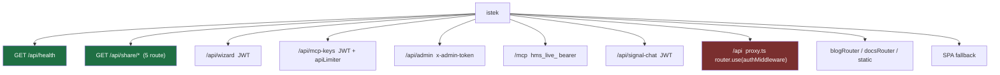
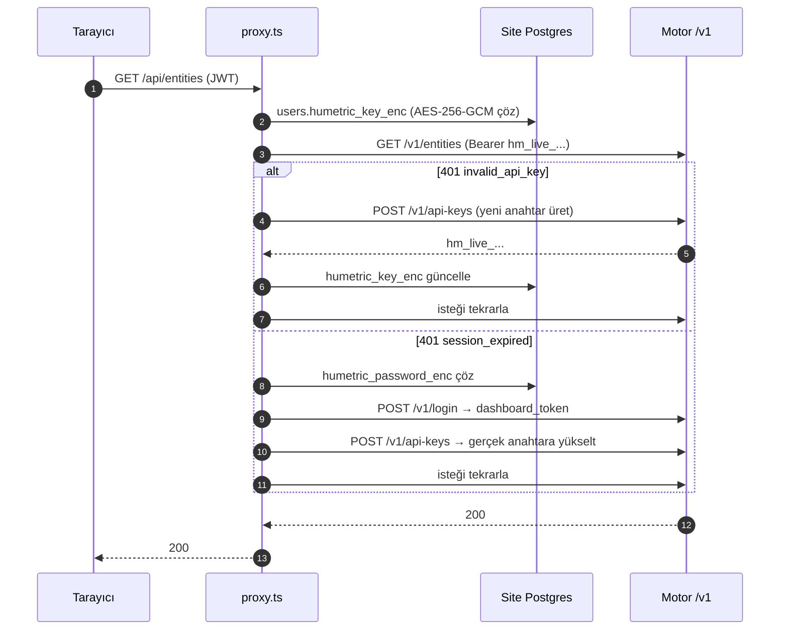
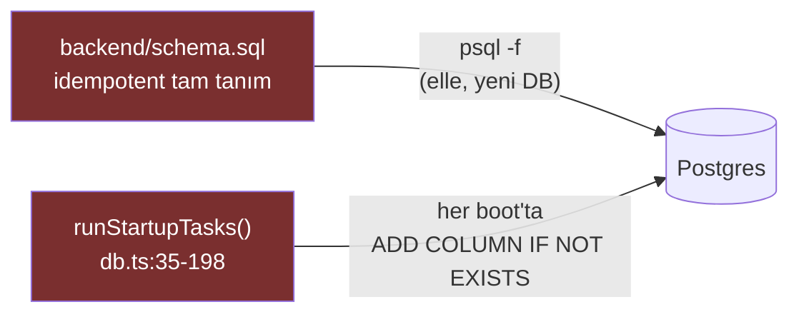
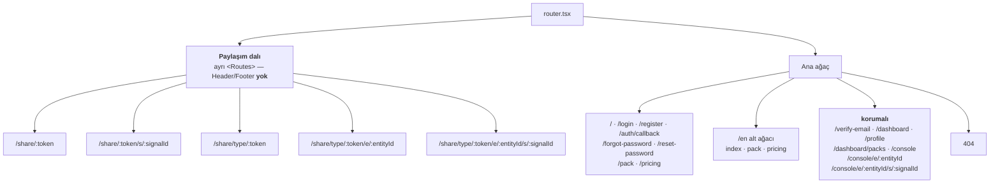
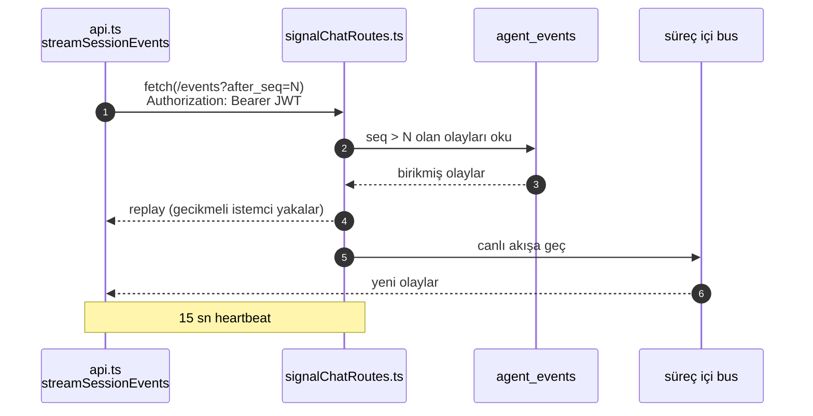

# humetric-site — İç Mimari

> Repo içi mimari referansı — yayınlanan siteye dahil değildir. Bkz.
> [`overview.md`](overview.md).
>
> ⚠️ Bu dosya **ayrı bir repoyu** (`../humetric-site`) anlatır. Motor tarafını
> anlamak için tüketen tarafı bilmek gerektiği için buradadır; **site kodu
> değişikliği bu repoya girmez.** Site'ın kendi `CLAUDE.md`'si kanonik kaynaktır.

Node/Express + React/Vite. Müşteriye dönük web sitesi, dashboard, konsol, Pack
Creator ve site MCP'si aynı süreçte yaşar.

```
humetric-site/
  backend/     Express 4 + TypeScript  (tsx watch → tsc → dist/)
  frontend/    React 18 + Vite 5 + Tailwind 3 + react-router 6
  backend/schema.sql          idempotent Postgres şeması, elle uygulanır
  backend/prompts/            signal-agent-system.md
  backend/content/blog/{tr,en}  8 yazı/dil, sunucu tarafında render
  n8n-templates/              içe aktarılabilir workflow'lar
```

Prod'da backend build edilmiş SPA'yı kendisi servis eder (`FRONTEND_DIR`) —
tek port, **3001**.

## 1. Express — mount sırası yük taşıyor



**Kritik:** `/api/health` ve beş `/api/share/*` route'u `proxyRouter`'dan **önce**
tanımlanmak zorundadır. `proxy.ts` router seviyesinde `router.use(authMiddleware)`
yapar; sonra tanımlanırlarsa eşleşmeyen her şey 401 olur.

`authMiddleware` **route bazında** uygulanır, asla `app.use` ile global değil —
site'ın kendi dokümantasyonunda 1 numaralı tehlike olarak işaretli.

### Auth katmanları

| Yüzey | Yöntem |
|---|---|
| Panel oturumu | bcrypt + **JWT HS256, 24 sa**; tarayıcıda `localStorage['token']` |
| Site MCP | `Authorization: Bearer hms_live_...` → sha256 hash lookup |
| Admin kredi yükleme | sabit `x-admin-token`, `timingSafeEqual`; `ADMIN_API_TOKEN` yoksa endpoint tamamen **404** |
| Google OAuth | opsiyonel, yalnızca client id + secret birlikte varsa açılır |

Prod'da config **sert başarısız olur**: eksik/kısa `JWT_SECRET` veya 64-hex olmayan
`ENCRYPTION_KEY` süreci başlatmaz (`assertConfigValid()`).

Beş ayrı rate-limit kovası: `authLimiter`, `resetLimiter` (bilinçli olarak ayrı),
`strictLimiter`, `apiLimiter` (600/15dk), `shareLimiter` (60/15dk). Body limiti
kademeli: `/api/packs/wizard` ve `/mcp` için 6 MB, diğerlerinde 256 KB.

## 2. Motor ile konuşma — `proxy.ts` kör bir geçiş değil

`humetricClient.ts` tek çıkış noktasıdır: `hmFetch()` `${HUMETRIC_API_URL}/v1${path}`
kurar ve bearer ekler. Başarısızlıkta `{ok:false, status, data, error, code}` döner —
`code` alanı motorun makine hata kodunu taşır.

`proxy.ts` route bazlı bir **allowlist** + **kimlik kendi kendini onarma**
katmanıdır:



Ek kapı: `requirePaidTier()` `GET /v1/tenant/dashboard`'ı okur, 401'de bir kez
yeniler, free tier'ı **402** ile keser — Pack Creator'ın sunucu tarafı kapısı
(`PACK_CREATOR_REQUIRE_PAID`). Query parametreleri `withQuery()` ile allowlist'ten
geçer, `req.query` olduğu gibi iletilmez.

**Motorda kullanılan `/v1/*` yüzeyi:** `login`, `register`, `verify-email`,
`api-keys` (GET/POST/DELETE), `tenant/dashboard`, `tenant/export`,
`tenant/start-trial`, `tenant/keys` (PUT/DELETE), `usage`, `usage/packs`,
`signals` (POST/GET/`:id/trace`), `entities` (POST/GET/liste, `/metrics`,
`/metrics/:key/history`, `/metrics/:key/explain`, `/signals`), `query`,
`packs` (GET/POST/`:key`).

## 3. Şema — migration framework yok



Şema **iki yerde elle senkron** tutulur. Kolonu yalnızca birine eklemek dokümante
edilmiş 1 numaralı hata modudur: yeni DB'de çalışır, mevcut DB'de patlar (veya
tersi).

`runStartupTasks()` ayrıca veri düzeltmesi yapar: çökmüş oturumları yeniden
kuyruğa alır, e-postaları küçük harfe çevirir, `llm_providers`'ı geri doldurur ve
mevcut kullanıcılara tek seferlik kayıt kredisi verir (partial unique index ile
korunur).

12 tablo ve kullanıcı hafızasının nerede durduğu:
[`data-model.md` §5](data-model.md#5-site-veritabanı-ayrı-repo-ayrı-postgres).

## 4. Frontend

**State yönetimi: yalnızca React Context.** Redux, Zustand veya React Query yok.
`AuthProvider` `{user, token, loading}` tutar, `LanguageContext` locale tutar,
gerisi lokal `useState` + `useEffect`.

`api.ts` içinde `API_BASE = '/api'` — same-origin, env değişkeni yok. Frontend
**hiç** `import.meta.env` okumaz; build-time config yoktur.

### Route ağacı



Paylaşım route'ları kimlik doğrulaması istemez ve site kabuğunu (header/footer)
hiç yüklemez — link paylaşılan kişi kayıt olmaya zorlanmaz.

### Sayfa → endpoint

| Sayfa | Çağırdığı endpoint'ler |
|---|---|
| `Dashboard.tsx` | `/apikeys` (liste/oluştur/sil), `/dashboard`, `/usage`, `/tenant-keys` (GET/PUT/DELETE), `/mcp-keys` (liste/oluştur/sil), `/mcp-keys/credit/balance`, `/mcp-keys/credit/ledger` — BYOK + MCP anahtarı + kredi ekranı |
| `Packs.tsx` (Pack Creator) | `/dashboard`, `/tenant-keys`, `/packs`, `/wizard-runs` (CRUD + `/publish`), `/wizard/sessions` (+ **SSE** `/events`), `/packs/:key`, `/usage/packs`, `/pack-test`, `/start-trial` |
| `Profile.tsx` | `/dashboard`, `/auth/profile`, `/auth/change-password`, `/export` |
| `Pricing.tsx` | `/dashboard`, `/start-trial` |
| `ConsolePortfolio.tsx` | `/entities`, `/entity-types/:type/share` (GET/PATCH) |
| `ConsoleEntity.tsx` | `/entities/:id`, `/metrics`, `/signals`, `/metrics/:key/history`, `/metrics/:key/explain`, `/entities/:id/share` |
| `ConsoleSignal.tsx` | `/entities/:id`, `/signals/:id/trace` |
| `SignalAgentChat.tsx` | `/signal-chat/sessions` (start/answer/cancel/get) + SSE |
| `PlanRunner.tsx` | `/entities`, `/signals`, `/entities/:id/metrics` — site MCP `run_plan`'in tarayıcı ikizi |
| `Pack.tsx` | statik pazarlama sayfası, `api.ts`'ten hiçbir şey çağırmaz |

## 5. SSE — `EventSource` değil



`EventSource` **kullanılmaz** çünkü Authorization başlığı ayarlayamaz; bunun yerine
`fetch` + `?after_seq=N`. Olaylar `agent_events`'te kalıcı olduğu için bağlantı
koparsa istemci kaldığı yerden devam eder.

## 6. Deploy

İki aşamalı `Dockerfile`: builder (`node:20-bookworm`) iki workspace'i `npm ci` ile
kurar, `vite build` + `tsc` çalıştırır, sonra `npm prune --omit=dev`. Runtime
(`node:20-bookworm-slim`) yalnızca `backend/{package.json,node_modules,dist,prompts,
content,public}` + `frontend/dist` kopyalar, `USER node` ile çalışır, 3001'i açar.

`HEALTHCHECK` `/api/health`'i çağırır — süreç ayakta ama Postgres'e ulaşamıyorsa
container **unhealthy** raporlar.

Dağıtım hedefi Dokploy/Traefik. `docker-compose.mail.yml` yalnızca lokal Mailpit
içindir, prod'a ait değildir.

**Bilinen tuzak:** backend repo kökündeki `.env`'i değil **`backend/.env`**'i okur.

### Env değişkenleri

`.env.example`'da olanlar: `DATABASE_URL`, `JWT_SECRET`, `ENCRYPTION_KEY`, `PORT`,
`NODE_ENV`, `SITE_URL`, `CORS_ORIGINS`, `TRUST_PROXY`, `HUMETRIC_API_URL`,
`GOOGLE_OAUTH_CLIENT_ID/SECRET`, `ANTHROPIC_API_KEY`, `OPENAI_API_KEY`,
`DEEPSEEK_API_KEY`, `GOOGLE_AI_API_KEY`, `PACK_CREATOR_REQUIRE_PAID`, `SMTP_*`,
`MAIL_TRANSPORT`, `GA_MEASUREMENT_ID`, `*_SITE_VERIFICATION`, `INDEXNOW_KEY`.

Kod tarafından okunan ama `.env.example`'da **olmayanlar** (dokümantasyon açığı):
`ADMIN_API_TOKEN`, `SIGNUP_GRANT_CENTS`, `AGENT_MAX_TURNS`, `AGENT_MODEL`,
`PACK_OPENAI_MODEL`, `PACK_DEEPSEEK_MODEL`, `PACK_GOOGLE_MODEL`,
`PACK_PROVIDER_MAX_TOKENS`, `OPENAI_BASE_URL`, `DEEPSEEK_BASE_URL`,
`GOOGLE_AI_BASE_URL`, `GENTIC_BASE_URL`, `SIGNAL_AGENT_ENGINE`,
`SIGNAL_AGENT_TURNS_PER_MESSAGE`, `USE_LEGACY_PACK_AGENT`,
`GOOGLE_OAUTH_REDIRECT_URI`, `FRONTEND_DIR`, `OG_IMAGE_URL`,
`SITE_TEST_DATABASE_URL`.
