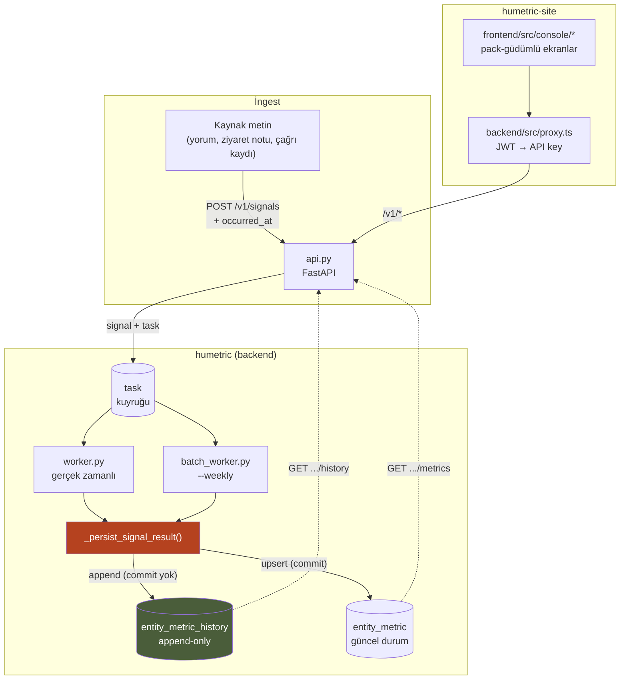
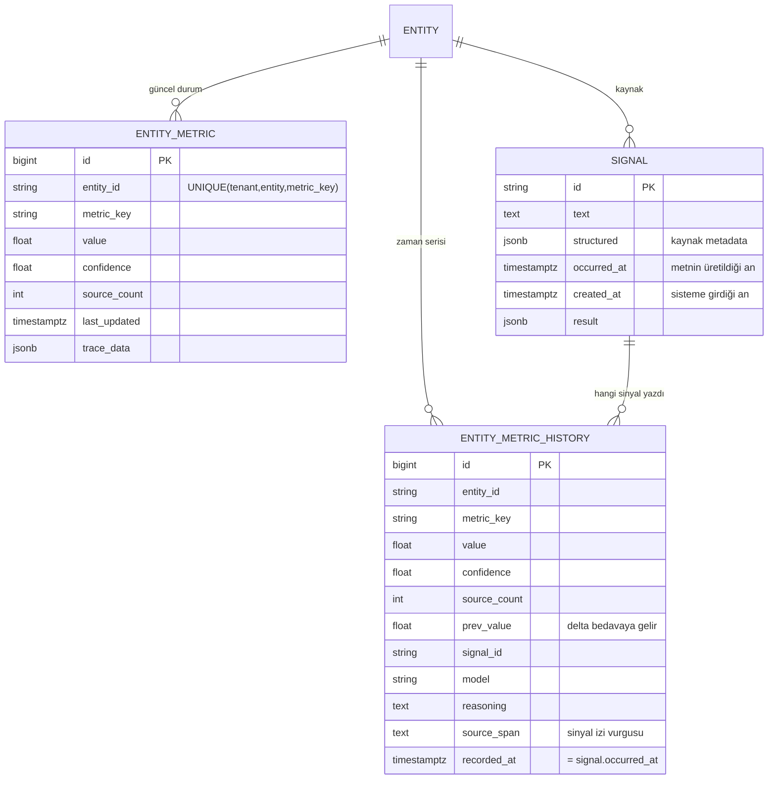
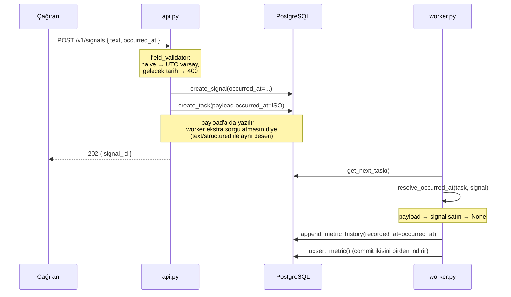
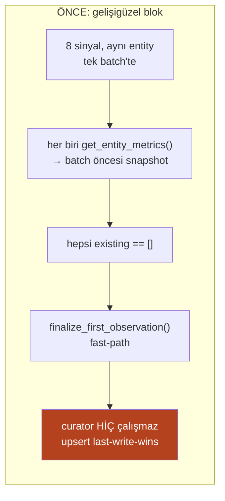
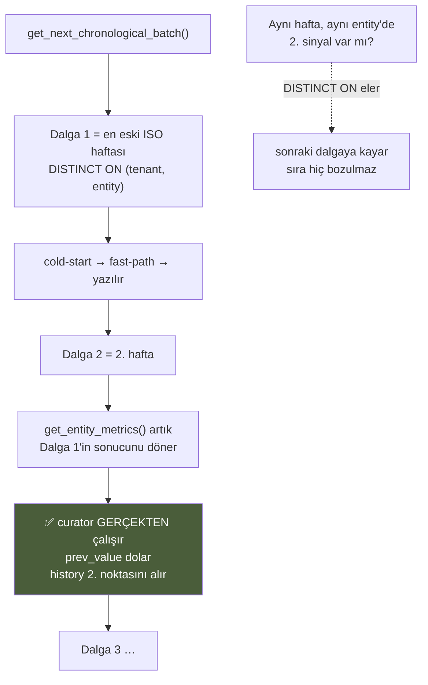
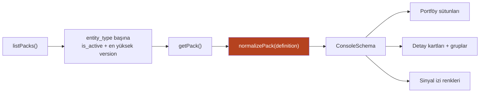

# Konsol & Metrik Geçmişi

> **Durum:** Uygulandı (2026-08-08)
> **Kapsam:** `humetric` (backend) + `humetric-site` (site/dashboard)
> **Amaç:** Bu modülü ileride geliştirecek kişi için tek referans. İş gerekçesi,
> mimari kararlar, veri modeli, API yüzeyi ve tuzaklar burada.

---

## 1. Tek paragraf özet

HuMetric artık her metrik yazımını `entity_metric_history` tablosuna
kaydediyor, sinyaller `occurred_at` ile gerçek zaman damgası taşıyor ve toplu
geri yükleme `--weekly` moduyla kronolojik dalgalar hâlinde çalışıyor. Bunun
üzerine `humetric-site` içinde, tamamen Metric Pack'ten türetilen üç ekranlık
bir **Konsol** eklendi: Portföy, Varlık Detayı, Sinyal İzi. Yeni müşteri için
frontend kodu yazılmıyor — yeni bir YAML yeterli.

---

## 2. İş gerekçesi

### Problem

HuMetric bugüne kadar yalnızca **geliştiriciye** satıyordu: API key, kota,
docs, pack YAML. Satın alma kararını veren kişi (marka müdürü, kategori
sorumlusu, saha yöneticisi) ürünün ürettiği metrikleri hiçbir yerde
göremiyordu. Kurumsal satışta ürünü göremeyen kişi ürünü satın almaz.

Üstelik motorun en güçlü iddiası — *"zamansal sönümleme + geçmişle uzlaştırma"* —
kanıtlanamıyordu, çünkü **geçmiş hiç tutulmuyordu**.

### Üç katmanlı boşluk

| # | Boşluk | Sonuç |
|---|--------|-------|
| 1 | `entity_metric` üzerinde `UniqueConstraint(tenant_id, entity_id, metric_key)` var; `Store.upsert_metric` her sinyalde satırı körlemesine üzerine yazıyordu | Trend çizgisi, backtest, "hangi sinyal skoru ne kadar oynattı" analizi **imkânsız** |
| 2 | `SignalCreate` zaman alanı taşımıyordu; `signal.created_at` = ingest anı | 12 aylık tarihsel veri yüklense bile hepsi "bugün" olur, trend tek noktaya çöker |
| 3 | `batch_worker` kuyruktan gelişigüzel blok çekiyordu | Aynı entity'nin tüm sinyalleri "geçmiş yok" görüp fast-path'e düşüyor → **curator hiç çalışmıyor**, yazımlar last-write-wins |

3. madde en sinsisi: toplu geri yükleme tam da ürünün farklılaştırıcısını
devre dışı bırakıyordu.

### Neden Konsol müşteriye özel yazılmıyor

**Metric Pack YAML zaten bir UI şemasıdır.** `PackDefinition` içinde
`entity_type`, `label`, `metrics[].key/label`, `required_fields[].key/label/type`
ve `kvkk.sensitive_metrics` var. Yani portföy tablosunun sütunları, detay
sayfasının alanları ve gizlenecek metrikler zaten tanımlı.

Eksik olan tek şey *sunum* bilgisiydi: metriğin hangi ucunun "iyi" olduğu,
hangi alanın varlık başlığı olduğu. Bunu `display:` bloğu çözüyor (bkz. §7).

> **Satış argümanı:** "Sektörünüzü iki paragrafla anlatın" → wizard pack üretir
> → **konsol kendini o pack'e göre çizer**. Rakip "6 hafta özelleştirme" derken
> ekran canlı kuruluyor.

---

## 3. Mimari genel bakış



**Kritik nokta:** `_persist_signal_result` hem gerçek zamanlı hem toplu
worker tarafından paylaşılıyor. Geçmiş yazımı oraya konduğu için her iki yol da
otomatik kapsanıyor. Bu fonksiyona dokunan her değişiklik iki worker'ı birden
etkiler.

---

## 4. Veri modeli



### `recorded_at` semantiği — en kritik alan

`entity_metric_history.recorded_at` **`signal.occurred_at`'ten gelir**,
`now()`'dan değil. Kolonun `server_default=now()` değeri yalnızca güvenlik
ağıdır.

> ⚠️ **Bu ikisi karışırsa hata alınmaz, sadece trend düzleşir.** Sessiz bozulma
> riski yüksek olduğu için doğrulama testi (§9) pazarlıksızdır.

### `confidence` vs `effective_confidence`

Geçmiş uçları her noktada iki alan döndürür:

- **`confidence`** — o an kaydedilen ham değer. Grafikte çizilecek doğru çizgi.
- **`effective_confidence`** — `decayed_confidence(confidence, recorded_at)`,
  yani "bugün o noktaya ne kadar güveniyoruz".

İkisi aynı şey değildir, birbirinin yerine kullanılmaz. `decay.py` bilinçli
olarak **okuma zamanında** çalışır; ham güven denetlenebilir kalsın diye yazma
anında çarpan uygulanmaz.

### RLS

`entity_metric_history` yeni bir tenant tablosu olduğu için migration'da
elle RLS kurulur: `ENABLE` + `FORCE ROW LEVEL SECURITY`, `tenant_isolation`
policy, `humetric_app` rolüne tablo GRANT'i **ve BIGSERIAL olduğu için sequence
GRANT'i**. Şablon `alembic/versions/015_metering_record_rls.py`'dedir; 015'in
docstring'i sequence grant'i atlanınca ne kırıldığını anlatır.

---

## 5. Zaman ekseni: `occurred_at`



### İngest kuralı — tarihsel yüklemede sinyalin birimi

Geri yüklemede sinyal birimi **tek yorum değil, `(entity, hafta)`** olmalıdır:

- O haftanın yorumları tek sinyal metninde birleştirilir
- `occurred_at` = hafta sonu
- Tek tek yorumlar `structured.items` içinde provenance olarak kalır

Üç faydası: entity başına haftada tek nokta (okunabilir trend), curator pencere
başına bir kez gerçekten çalışır, LLM maliyeti düşer.

### Kaynak metadata konvansiyonu

Şema değişikliği gerekmez. `structured` JSONB'sine konur:

```json
{ "source": "trendyol", "url": "...", "author_ref": "<hash>", "items": [...] }
```

`GET /v1/entities/{id}/signals` bunu `source` alanı olarak okur.
**Yazar kimliği hash'lenmeden saklanmaz** — KVKK argümanını demonun kendisi
çürütmesin.

---

## 6. Kronolojik batch modu (`--weekly`)

Bu, modülün en ince mekaniği.

### Sorun



### Çözüm



### Uygulama notları

- **Anahtar:** `python -m humetric.batch_worker --weekly`, env karşılığı
  `HUMETRIC_BATCH_CHRONOLOGICAL=true`. Kapalıyken davranış **birebir eskisi
  gibi** kalır (geriye dönük uyum).
- **Pencere birimi:** `HUMETRIC_BATCH_WINDOW`, varsayılan `week`.
  `day | week | month` whitelist'i `store._BATCH_WINDOW_UNITS`'ta.
- Batch'in kendi Phase A/B yapısı ve yazma fazı **hiç değişmedi** — tek değişen
  hangi görevlerin claim edildiği.
- PostgreSQL `DISTINCT ON` ile `FOR UPDATE` aynı sorguda kullanılamaz; bu
  yüzden iki adım: önce aday task id'leri, sonra `IN (...) FOR UPDATE SKIP LOCKED`.

### Maliyet

Dalga başına iki batch submit (extraction + curation). 24 aylık geri yükleme ≈
104 dalga. Token maliyeti aynı, çağrı sayısı ve duvar saati artar. Bir kerelik
yükleme için kabul edilebilir; **canlıda gerçek zamanlı worker kullanılmaya
devam edilir.**

---

## 7. Pack `display:` bloğu

Pack "ne ölçüldüğünü" biliyordu, "nasıl gösterileceğini" bilmiyordu. En keskin
örnek `packs/lastik-bayi.yaml`: `kayip_riski` metriğinin yön bilgisi prompt'un
içine **düz yazı yorum** olarak gömülmüştü ("YÜKSEK değer = DÜŞÜK risk"). UI
bunu okuyamaz, yanlış renge boyardı.

```yaml
metrics:
  - key: iade_riski
    label: "İade Riski"
    direction: lower_is_better     # higher_is_better (varsayılan) | lower_is_better
    unit: ""
    bands:                          # ham değer ekseninde, bir kez yazılır
      - { max: -0.2, level: critical }
      - { max: 0.3,  level: warn }
      - { max: 1.0,  level: good }

display:
  title_field: ad                   # entity.fields serbest JSONB — başlık hangisi
  subtitle_field: kategori
  primary_metrics: [tat, ambalaj, iade_riski]   # portföy sütunları
  groups:
    - label: "Tüketici"
      metrics: [tat, fiyat_algisi]
    - label: "Operasyon"
      metrics: [ambalaj, iade_riski]
```

**Hepsi opsiyoneldir.** Mevcut dört pack tek karakter değişmeden geçerli kalır;
konsol eksik alanlarda makul varsayılan üretir:

| Alan | Varsayılan |
|---|---|
| `title_field` | ilk `required_fields[].key`, o da yoksa `entity.id` |
| `primary_metrics` | ilk 4 metrik |
| `direction` | `higher_is_better` |
| `bands` | `-0.2 / 0.3` eşikli critical-warn-good |
| `groups` | tek "Genel" grubu |

`direction` bant aramasında ölçeği aynalar: `lower_is_better` bir metrikte
`levelFor()` değeri negatifleyip bakar. Yani pack yazarı bantları bir kez yazar,
elle ters çevirmez.

> **Kapsam dışı (sonraki iş):** `wizard.generate_pack()` henüz `display` bloğu
> üretmiyor. Prompt revizyonu gerekiyor — bu, demoyu belirgin şekilde
> güçlendirecek en ucuz sonraki adım.

---

## 8. API yüzeyi

| Metot | Yol | Scope | Not |
|---|---|---|---|
| `POST` | `/v1/signals` | `signals:write` | **+ `occurred_at`** (opsiyonel, gelecek tarih 400) |
| `GET` | `/v1/entities` | `entities:read` | Portföy listesi (mevcuttu) |
| `GET` | `/v1/entities/{id}/metrics` | `entities:read` | **`?include_history=true` artık gerçekten çalışıyor** (metrik başına son 30 nokta) |
| `GET` | `/v1/entities/{id}/metrics/{key}/history` | `entities:read` | **YENİ** — `since/until/limit(≤500)/offset`, `recorded_at ASC` |
| `GET` | `/v1/entities/{id}/metrics/{key}/explain` | `entities:read` | **+ `contributions[]`** (`?contributions=N`, ≤100) |
| `GET` | `/v1/entities/{id}/signals` | `signals:read` | **YENİ** — `status/limit(≤100)/offset`, `created_at DESC` |
| `GET` | `/v1/signals/{id}/trace` | `signals:read` | **+ `text`, `structured`, `occurred_at`** — konsolun vurgulama için ihtiyacı |

### KVKK kapısı

Hassas ve rızasız bir metrik için history ve explain uçları **403 değil 404**
döner. Gerekçe: 403 metriğin varlığını sızdırır. `_assert_metric_visible()`
bu davranışı tek yerde toplar.

Ayrıca worker'daki KVKK atlaması geçmiş yazımından **önce** çalışır — rızasız
hassas metrik geçmişe de yazılmaz.

---

## 9. Frontend mimarisi (`humetric-site`)

### Dosya haritası

```
frontend/src/
  console/
    packSchema.ts       Pack definition → ConsoleSchema (saf fonksiyon, test edilebilir)
    usePackSchema.ts    Aktif pack'i entity_type'a göre çözer
    ConsoleShell.tsx    Sayfa kabuğu + tema seam'i
    MetricChart.tsx     Inline SVG trend grafiği (sıfır bağımlılık)
  pages/
    ConsolePortfolio.tsx    /console
    ConsoleEntity.tsx       /console/e/:entityId
    ConsoleSignal.tsx       /console/e/:entityId/s/:signalId
```

### Veri akışı



`GET /packs/:key` `definition`'ı **zaten JSON** döndürür — YAML parser
bağımlılığı yoktur ve gerekmez.

### Grafik neden elle yazıldı

Tek grafik tipi var (confidence bantlı çizgi). `recharts` ~500KB'lık erken
bağımlılık olurdu; sitenin tamamı elle yazılmış CSS. `MetricChart.tsx` ~180
satır inline SVG. Tooltip/zoom/brush ihtiyacı doğarsa o zaman kütüphane eklenir.

Değer ekseni **-1..1'de sabittir**, veriye göre yeniden ölçeklenmez —
yeniden ölçeklenen eksen, değişmeyen bir metriği oynak gösterir.

### Sinyal izi — farklılaştırıcı ekran

`source_span` sayesinde ham sinyal metni içinde skorun dayandığı cümle
vurgulanır. Segmentasyon `ConsoleSignal.tsx:segment()` içinde: span'ler
**uzundan kısaya** eşleştirilir ki iç içe geçen kısa span uzunu bölmesin.

Bunun çalışması için worker `signal.result["metrics"]` içine `reasoning` ve
`source_span` yazar — bu alanlar bu iş kapsamında eklendi.

> Ekranların görsel emeği buraya yatırılmalı. Portföy zaten tablo olmalı;
> jenerik UI'ın "sayı tablosu" estetiğine kaymasının panzehiri bu ekrandır.

### Header butonu

`.hm-header-right` içinde, nav dizisinin **dışında**: dolgulu bir aksiyon
butonu, başka bir nav linki değil. Sadece `user` varken görünür,
`pathname.startsWith('/console')` ile aktifleşir.

### Tema seam'i (sonraki faz için hazır)

Konsolun tüm renkleri `.hm-console` üzerindeki CSS custom property'lerinden
okunur:

```css
.hm-console {
  --surface: var(--paper2);
  --accent: var(--rust);
}
```

Global `:root` token'larına **hiç dokunulmaz**. Tenant bazlı marka/tema
geldiğinde `tenant.branding` bu iki property'yi runtime'da yeniden yazar ve
tek satır bileşen kodu değişmez.

### Proxy

`backend/src/proxy.ts`'de catch-all passthrough **yoktur**; her yeni uç için
açık rota gerekir. Query string'ler `withQuery(req, path, allowed)` ile
**whitelist üzerinden** iletilir — `req.query`'yi körlemesine geçirmek
upstream'e parametre enjeksiyonuna izin verirdi.

---

## 10. Doğrulama

Uygulama sırasında koşulan ve tekrar koşulması gereken kontroller:

**Migration**
- `alembic upgrade head` → `downgrade -1` → `upgrade head` gidiş-dönüşü temiz
- `entity_metric_history`: RLS enabled + forced, `tenant_isolation` policy,
  `humetric_app`'e SELECT/INSERT/UPDATE/DELETE
- Fail-closed: `app.tenant_id` **set edilmeden** sorgu → 0 satır ✅

**Kuyruk / geçmiş (16 kontrol)**
- Kronolojik dalgalar en eskiden yeniye ilerliyor
- Hiçbir dalga aynı entity'yi tekrarlamıyor
- Aynı haftadaki ikinci sinyal sonraki dalgaya kayıyor
- `prev_value` zinciri kopuksuz, `recorded_at` `occurred_at`'i taşıyor
- `since` filtresi, `contributions` sıralaması, sinyal listesi sayfalama

**HTTP (26 kontrol)**
- `occurred_at` kabul / gelecek tarih 422 / alansız istek geriye dönük uyumlu
- History uçları, limit clamp'leri, bilinmeyen metrikte 404
- `include_history` artık dolu dönüyor
- `display` + `direction` + `bands` round-trip'te korunuyor
- Trace `text` ve `occurred_at` taşıyor

**Pack normalizasyonu (20 kontrol)**
- Gerçek `lastik-bayi.yaml` (display bloğu **yok**) varsayılanlarla düzgün
  normalize oluyor
- `lower_is_better`: yüksek değer `critical`, düşük değer `good` — yön gerçekten
  ters çeviriyor
- Bozuk/eksik definition çökmüyor

**Frontend**
- `tsc --noEmit` temiz, `vite build` temiz
- Canlı stack'te (API + site + vite) konsol gerçek veriyle render ediliyor

> **Not:** Depodaki `tests/` dizini gitignore'da ve şu an pytest-asyncio
> event-loop uyumsuzluğu yüzünden büyük ölçüde kırık (bu işten **önce** de
> kırıktı: baseline 62 fail / 60 pass, sonrası 60 fail / 62 pass). Yukarıdaki
> kontroller bu yüzden bağımsız script'lerle koşuldu. Suite'i onarmak ayrı bir
> iş kalemidir.

---

## 11. Bu modülü geliştirirken dikkat

Sırasıyla en çok canı yakacak olanlar:

1. **`recorded_at`'i `now()`'a düşürmeyin.** Hata vermez, sadece tüm trend
   özelliği sessizce ölür. `_persist_signal_result`'a dokunuyorsanız
   `occurred_at` parametresinin iki çağırandan da geldiğini doğrulayın
   (`worker.py` ve `batch_worker.py`).

2. **`append_metric_history` commit etmez.** `upsert_metric`'in commit'ine
   binmesi için **ondan hemen önce** çağrılmalıdır. Sıra bozulursa geçmiş ile
   güncel durum ayrı transaction'lara düşer.

3. **Yeni tenant tablosu = elle RLS.** Model + migration yetmez; ENABLE, FORCE,
   policy, tablo GRANT **ve sequence GRANT** gerekir. Atlanırsa `humetric_app`
   rolüyle çalışan API/worker "permission denied" alır.

4. **`_persist_signal_result` paylaşımlıdır.** Buraya eklenen her şey hem
   gerçek zamanlı hem toplu worker'ı etkiler. Bu bir özellik, ama fark
   edilmezse sürpriz olur.

5. **`DISTINCT ON` + `FOR UPDATE` aynı sorguda çalışmaz.** Kronolojik claim
   bu yüzden iki adımlıdır; tek sorguya indirgemeye çalışmayın.

6. **Proxy'de catch-all yok.** Yeni bir HuMetric ucu eklediyseniz
   `humetric-site/backend/src/proxy.ts`'e açık rota + `withQuery` whitelist'i
   eklemeden konsolda görünmez.

7. **`confidence` ile `effective_confidence`'ı karıştırmayın.** Grafikte ham
   değer, "bugün ne kadar güveniyoruz" sorusunda sönümlenmiş değer.

8. **Pack alanları hep opsiyonel + varsayılanlı kalmalı.** Zorunlu bir alan
   eklemek sahadaki tüm pack'leri anında geçersiz kılar.

---

## 12. Bilinen sınırlar ve sonraki adımlar

| Konu | Durum | Not |
|---|---|---|
| Tablo büyümesi | Kabul edildi | Sinyal × metrik = 1 satır. Yüksek hacimde eski kayıtları günlük özete indiren zamanlanmış iş gerekecek; index (`ix_emh_lookup`) şimdiden doğru. |
| Tenant içi rol | **Yok** | RLS tenant'lar arasını korur; tenant *içinde* "marka müdürü sadece kendi SKU'larını görsün" ayrımı yok. Kurumsal müşterinin ilk soracağı şey. |
| Tenant marka/teması | Seam hazır, dolu değil | `tenant.branding` JSONB + `--surface`/`--accent` yazımı. Bileşen kodu değişmeyecek. |
| Wizard `display` üretimi | Yok | En ucuz demo iyileştirmesi. |
| `tests/` suite | Kırık (önceden de) | pytest-asyncio event-loop uyumsuzluğu. |
| Kronolojik mod duvar saati | Kabul edildi | Dalga sayısı kadar batch submit. Sürekli akış için değil, geri yükleme için. |

---

## 13. İlgili dosyalar

**Backend (`humetric`)**
- `alembic/versions/016_signal_occurred_at_and_metric_history.py`
- `src/humetric/db/models.py` — `EntityMetricHistory`, `Signal.occurred_at`
- `src/humetric/store.py` — `append_metric_history`, `list_metric_history`,
  `list_metric_contributions`, `list_signals_for_entity`,
  `get_next_chronological_batch`
- `src/humetric/worker.py` — `resolve_occurred_at`, `_persist_signal_result`
- `src/humetric/batch_worker.py` — `run_batch_once(chronological=)`, `--weekly`
- `src/humetric/api.py` — history / signals / explain uçları,
  `_assert_metric_visible`, `_history_row_to_contribution`
- `src/humetric/schema.py` — `MetricContribution`, `MetricHistoryPoint`,
  `MetricHistoryResponse`, `SignalSummary`, `PackDisplay`, `PackBand`, `PackGroup`

**Site (`humetric-site`)**
- `backend/src/proxy.ts` — `withQuery` + konsol rotaları
- `frontend/src/console/*`, `frontend/src/pages/Console*.tsx`
- `frontend/src/humetric.css` — `.hm-console*`, `.hm-btn-console`
- `frontend/src/i18n/translations.ts` — `console.*`, `header.console`

**İlgili plan dokümanları**
- [Veri toplama stratejisi](/plans/scraping.example) — sinyal kaynakları,
  hukuki çerçeve, maliyet modeli

---

> **Mermaid notu:** Bu depodaki VitePress kurulumunda mermaid eklentisi yok;
> diagramlar GitHub'da render olur, docs sitesinde kod bloğu görünür. Sitede de
> render istenirse `vitepress-plugin-mermaid` eklenmelidir.
